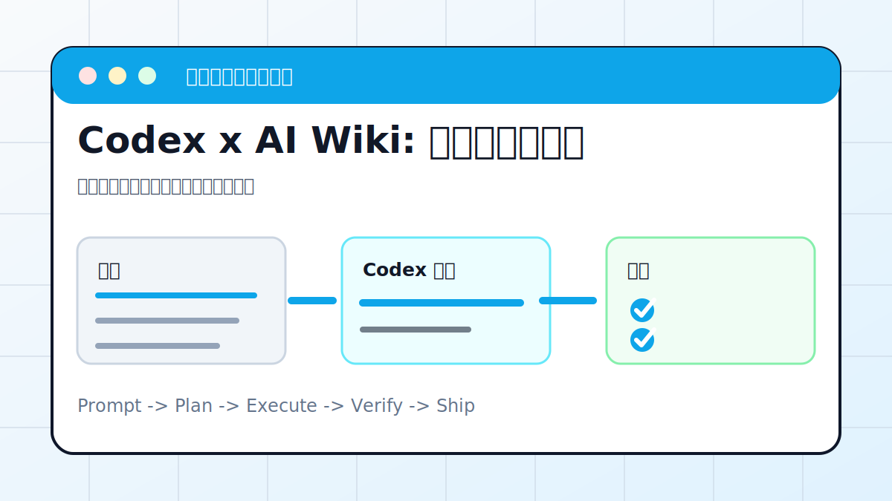

# Codex x AI Wiki: 搭建主题知识库



## 案例目标

让 Codex 把资料拆成概念、证据、案例和待补问题，形成长期维护的 Wiki。

**最终产出**：主题目录、概念页、证据表、阅读路线。

## 适合谁

要把零散资料整理成一套可复用知识库的人。

## 准备输入

- 主题
- 资料文件或链接
- 目标读者
- 输出目录

## 推荐提示词

```text
请把这些资料整理成一个 AI Wiki。要求：先设计目录；每个概念页包含定义、关键观点、证据来源、相关链接和待补问题；生成总索引和阅读路线。
```

## 执行流程

1. 盘点资料来源，区分已读和待读。
2. 设计 Wiki 信息架构。
3. 生成概念页模板。
4. 抽取证据和引用位置。
5. 建立索引、标签、待办清单。

## Codex 应该交付什么

- 一份可复查的执行摘要。
- 关键文件或产物路径。
- 运行过的验证命令。
- 未完成事项和风险说明。

## 验收标准

- 目录层级清晰。
- 每个结论能追到来源。
- 有待补问题，不伪装确定。
- 新增资料有放置规则。

## 常见风险

- 把未经验证的资料写成事实。
- 页面太碎，无法维护。
- 没有来源表。

## 复盘模板

```text
目标是否完成：
改动 / 产物：
验证命令：
验证结果：
保留或安全要求：
下一步：
```

## 下一步

如果知识库在 Notion，继续看 notion-mcp.md。
