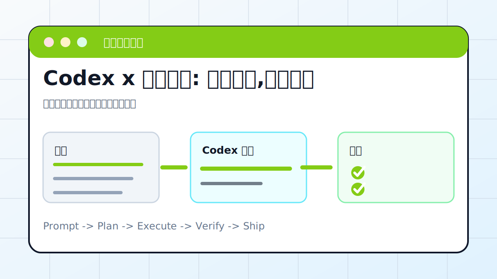

# Codex x 安卓手机: 扫码连接,远程操控



## 案例目标

让手机和桌面任务协同，能查看、继续或确认任务。

**最终产出**：手机端连接状态、远程任务操作记录。

## 适合谁

想在手机上跟进桌面 Codex 任务的人。

## 准备输入

- ChatGPT App
- 桌面 Codex App
- 同一账号
- 网络环境

## 推荐提示词

```text
请帮我检查安卓手机远程控制 Codex 的连接流程。要求：先列出账号、网络、二维码、权限检查项；不要操作敏感页面；给出失败排查表。
```

## 执行流程

1. 确认手机和桌面使用同一账号。
2. 检查网络和二维码配对入口。
3. 确认桌面 App 线程可见。
4. 在手机端查看任务状态或补充指令。
5. 记录常见失败和解决办法。

## Codex 应该交付什么

- 一份可复查的执行摘要。
- 关键文件或产物路径。
- 运行过的验证命令。
- 未完成事项和风险说明。

## 验收标准

- 手机能看到目标任务。
- 补充指令能同步到桌面。
- 权限提示清楚。
- 敏感操作仍需确认。

## 常见风险

- 账号不一致。
- 网络或防火墙阻断。
- 手机端误确认高风险操作。

## 复盘模板

```text
目标是否完成：
改动 / 产物：
验证命令：
验证结果：
保留或安全要求：
下一步：
```

## 下一步

想做个人工作台可看 obsidian.md。
