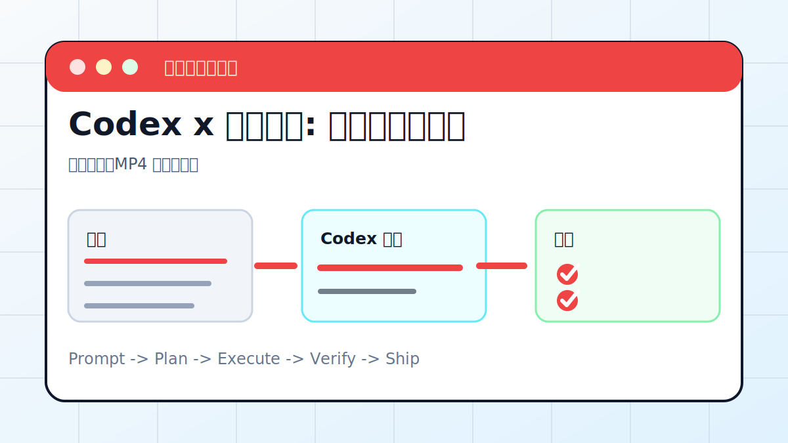

# Codex x 动画视频: 用代码生成动画



## 案例目标

让 Codex 先写分镜，再用代码生成可预览动画，最后导出视频。

**最终产出**：网页动画、MP4 或分镜脚本。

## 适合谁

想把概念、流程或课程内容做成短视频的人。

## 准备输入

- 主题
- 脚本或讲稿
- 时长
- 画幅
- 风格参考

## 推荐提示词

```text
请把这段讲稿做成 60 秒竖屏动画视频。先输出分镜表，再生成可预览网页动画；确认后导出 MP4，字幕要完整且不遮挡主体。
```

## 执行流程

1. 把讲稿切成 5-8 个镜头。
2. 确定画幅、节奏、字幕位置和主视觉。
3. 生成网页动画或视频工程。
4. 本地预览并截图检查关键帧。
5. 导出 MP4，并检查字幕、时长、分辨率。

## Codex 应该交付什么

- 一份可复查的执行摘要。
- 关键文件或产物路径。
- 运行过的验证命令。
- 未完成事项和风险说明。

## 验收标准

- 视频能播放。
- 字幕没有溢出或遮挡。
- 时长和画幅符合要求。
- 源工程可复用。

## 常见风险

- 一开始就导出视频，返工成本高。
- 字幕太长看不清。
- 素材版权或人物肖像风险。

## 复盘模板

```text
目标是否完成：
改动 / 产物：
验证命令：
验证结果：
保留或安全要求：
下一步：
```

## 下一步

需要封面和配图时接入图像生成流程。
