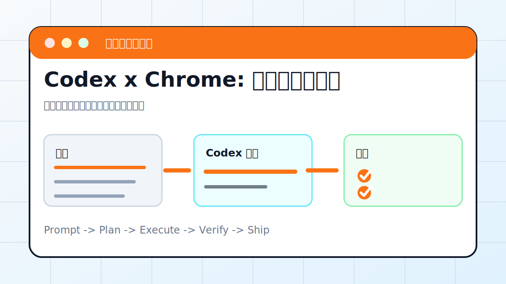

# Codex x Chrome: 直接控制浏览器



## 案例目标

让 Codex 在用户 Chrome 环境里完成明确、低风险的浏览器任务。

**最终产出**：基于用户登录态的页面操作记录和截图。

## 适合谁

需要使用自己 Chrome 登录态完成网页检查的人。

## 准备输入

- Chrome 插件或控制权限
- 目标网站
- 操作边界
- 截图要求

## 推荐提示词

```text
请使用 Chrome 打开这个后台页面，只查看列表和筛选功能，不点击删除、发布、支付、发送按钮。完成后截图并汇报筛选是否正常。
```

## 执行流程

1. 确认 Chrome 控制能力已启用。
2. 说明哪些按钮不能点击。
3. 打开目标页并等待登录态加载。
4. 执行只读检查或低风险交互。
5. 截图并汇报页面状态。

## Codex 应该交付什么

- 一份可复查的执行摘要。
- 关键文件或产物路径。
- 运行过的验证命令。
- 未完成事项和风险说明。

## 验收标准

- 截图显示正确页面。
- 没有触发高风险操作。
- 筛选/跳转结果可复现。
- 控制台无关键错误。

## 常见风险

- 误操作真实账号。
- 页面包含隐私数据。
- 让 Codex 输入验证码或支付。

## 复盘模板

```text
目标是否完成：
改动 / 产物：
验证命令：
验证结果：
保留或安全要求：
下一步：
```

## 下一步

公开页面测试优先用 playwright-mcp.md。
