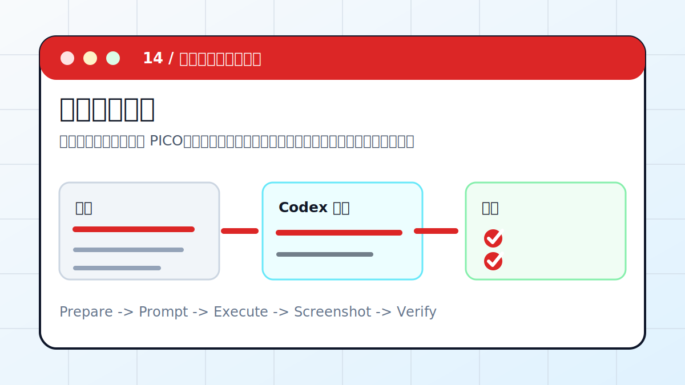

# Codex × 临床文献综述：把医学问题整理成证据表



把临床或科研问题拆成 PICO、纳入排除标准、逐篇证据表和局限性，而不是生成不可追溯的泛泛综述。

> 适合对象：需要整理医学、临床或高风险研究资料的人。
> 最终产出：PICO、检索策略、证据表、结论边界、引用清单

## 案例目标

这个案例不是让 Codex “讲讲怎么做”，而是让它交付一个能复查的工作结果。你要把输入、权限边界、验收标准提前说清楚，让 Codex 按“计划 -> 执行 -> 截图/文件 -> 验收”的顺序推进。

## 准备清单

- 研究问题
- PICO 或初始人群/干预/对照/结局
- 文献 PDF、DOI 或数据库导出
- 纳入排除标准
- 引用格式要求

## 推荐入口

| 项目 | 建议 |
| --- | --- |
| 推荐入口 | App / CLI / PDF / DOI |
| 先做什么 | 让 Codex 只读检查输入和环境 |
| 再做什么 | 确认计划后执行生成、整理或验证 |
| 最后做什么 | 输出产物路径、截图、验证方法和风险说明 |

## 实操步骤

1. 先把问题写成 PICO，并明确不回答什么。
2. 列出检索词、数据库和筛选标准。
3. 逐篇提取研究设计、样本、干预、结局、主要结果、局限性。
4. 把事实、作者结论、Codex 推断分开写。
5. 最后写证据等级、局限性和不能替代专业建议的边界。

## 可复制提示词

```text
请把这些临床文献整理成证据表。要求：先写 PICO 和纳入排除标准；逐篇提取研究设计、样本、干预、对照、结局、主要结果、局限性；所有结论必须能追到来源；不要给个体医疗建议。
```

## 过程截图与配图

- PICO 表：问题边界。
- 证据表：逐篇字段和来源。
- 结论页：事实、推断、局限性分开。

> 写教程或复盘时，建议把这些截图放在同名附件目录里。没有真实截图时，先保留“待补截图”占位，不要用与结果无关的装饰图冒充。

## 验收标准

- 每条结论有来源。
- 没有编造不存在的研究。
- 局限性单独列出。
- 不替代医生、药师或专业指南。

## 常见风险

- 不要把摘要当全文。
- 不要输出个体诊疗建议。
- 引用格式、年份和 DOI 要复查。

## 复盘模板

```text
目标是否完成：
输入材料：
Codex 做了什么：
产物路径或链接：
截图或证据：
验证命令 / 验证方法：
风险和未完成项：
下一步：
```

## 下一步

- 普通资料调研看 research-report。
- 主题知识库沉淀看 LLM Wiki。
