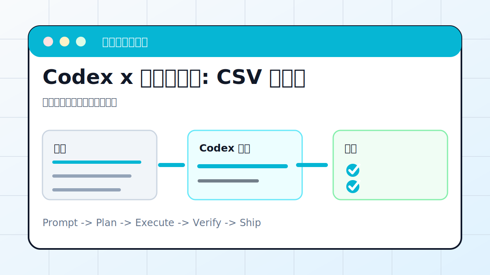

# Codex x 数据可视化: CSV 变图表



## 案例目标

让 Codex 用可复现脚本生成图表，并解释图表结论和数据质量问题。

**最终产出**：图表、分析说明、可复现脚本。

## 适合谁

手里有 CSV/Excel，想快速看趋势和异常的人。

## 准备输入

- CSV 或 Excel 文件
- 字段含义
- 想回答的问题
- 输出格式

## 推荐提示词

```text
请分析 data.csv，回答最近 30 天转化率变化。要求：先检查字段和缺失值；生成折线图和渠道对比图；输出图表文件、分析结论和可复现脚本。
```

## 执行流程

1. 读取字段和样例数据，确认编码和分隔符。
2. 做缺失值、重复值、异常值检查。
3. 选择合适图表，不用一张图塞所有信息。
4. 生成 PNG/SVG 和分析 Markdown。
5. 保存脚本，方便下次换数据重跑。

## Codex 应该交付什么

- 一份可复查的执行摘要。
- 关键文件或产物路径。
- 运行过的验证命令。
- 未完成事项和风险说明。

## 验收标准

- 图表文件存在。
- 坐标轴、单位、标题完整。
- 脚本能重复运行。
- 结论和数据证据对应。

## 常见风险

- 不检查数据质量就下结论。
- 图表颜色和标签不清。
- 把敏感数据贴到公开报告。

## 复盘模板

```text
目标是否完成：
改动 / 产物：
验证命令：
验证结果：
保留或安全要求：
下一步：
```

## 下一步

如果要做汇报页，接 ppt-skill.md。
