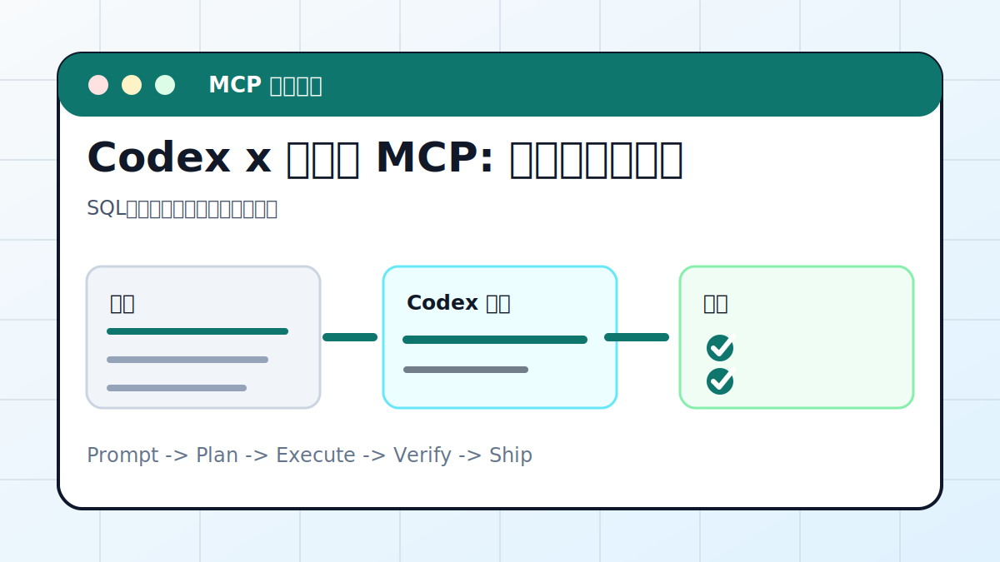

# Codex x 数据库 MCP: 自然语言查数据



## 案例目标

让 Codex 先理解表结构，再生成只读查询和解释结果。

**最终产出**：SQL、查询结果、报表和风险说明。

## 适合谁

想用自然语言查业务数据但需要可审计的人。

## 准备输入

- 数据库 MCP 配置
- 表结构
- 问题
- 权限边界

## 推荐提示词

```text
请通过数据库 MCP 查询上周各渠道注册和付费转化。要求：只读；先展示将执行的 SQL；不查询手机号、邮箱、token 等敏感字段；输出结果表和结论。
```

## 执行流程

1. 确认连接是只读账号。
2. 读取 schema 和字段说明。
3. 写 SQL 前解释查询逻辑。
4. 执行查询并检查行数、空值、异常值。
5. 输出表格、结论和可复查 SQL。

## Codex 应该交付什么

- 一份可复查的执行摘要。
- 关键文件或产物路径。
- 运行过的验证命令。
- 未完成事项和风险说明。

## 验收标准

- SQL 可读可复用。
- 没有查询敏感字段。
- 结果和业务口径一致。
- 大查询有限制条件。

## 常见风险

- 写操作误改数据。
- 全表扫描拖垮数据库。
- 把敏感数据复制到报告。

## 复盘模板

```text
目标是否完成：
改动 / 产物：
验证命令：
验证结果：
保留或安全要求：
下一步：
```

## 下一步

要把结果做图表，看 data-viz.md。
