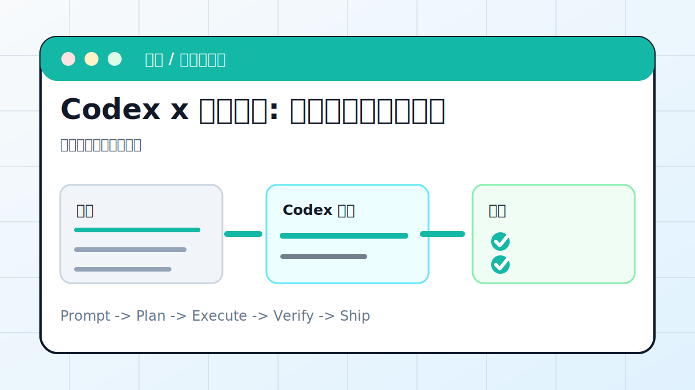

# Codex x 一键部署: 静态网页发布到公网



## 案例目标

让 Codex 检查静态站结构，选择最简单的部署方式，并给出可访问链接。

**最终产出**：一个可分享的公网链接。

## 适合谁

已经有静态网页，想把结果发给别人看的用户。

## 准备输入

- 静态 HTML/CSS/JS 项目
- GitHub 仓库或部署平台账号
- 域名或默认部署域名

## 推荐提示词

```text
请帮我把这个静态站部署到公网。先检查项目结构和构建方式，优先使用 GitHub Pages 或 Vercel。部署前确认不会删除原有中转站和购买链接，部署后检查首页、docs、recipes、reference。
```

## 执行流程

1. 确认项目是否纯静态，是否需要构建命令。
2. 检查 baseurl、CNAME、.nojekyll、资源路径。
3. 选择部署方式：GitHub Pages、Vercel 或静态文件托管。
4. 执行部署或生成部署说明。
5. 用 curl 和浏览器检查线上首页与关键 reader 页面。

## Codex 应该交付什么

- 一份可复查的执行摘要。
- 关键文件或产物路径。
- 运行过的验证命令。
- 未完成事项和风险说明。

## 验收标准

- 公网 URL 返回 200。
- CSS、favicon、图片资源可加载。
- reader.html?file=docs/guide/full-course.md 能打开。

## 常见风险

- baseurl 配错导致资源 404。
- 部署前没有提交最新内容。
- 把开发环境配置或密钥推到公开仓库。

## 复盘模板

```text
目标是否完成：
改动 / 产物：
验证命令：
验证结果：
保留或安全要求：
下一步：
```

## 下一步

部署后补 reference/faq.md 中的访问入口。
