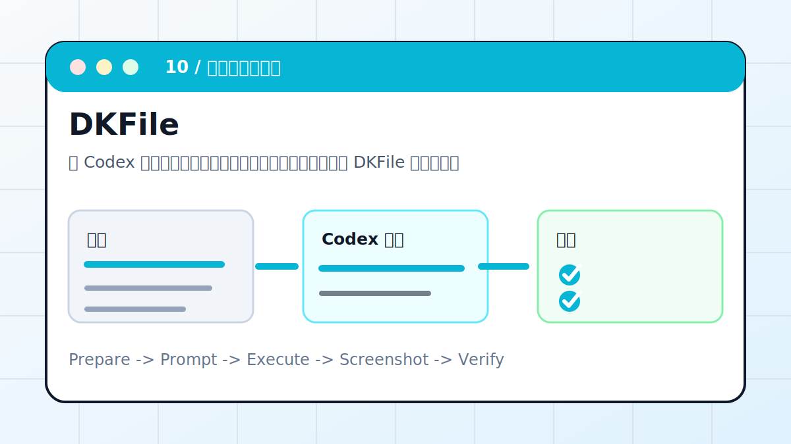

# Codex × DKFile：网页一键发布到公网



让 Codex 检查静态站结构、资源路径和入口链接，再通过 DKFile 或同类静态托管发布到公网。

> 适合对象：已经有静态网页，希望快速给别人预览的人。
> 最终产出：可访问公网链接、部署清单、资源路径检查结果

## 案例目标

这个案例不是让 Codex “讲讲怎么做”，而是让它交付一个能复查的工作结果。你要把输入、权限边界、验收标准提前说清楚，让 Codex 按“计划 -> 执行 -> 截图/文件 -> 验收”的顺序推进。

## 准备清单

- 静态 HTML/CSS/JS 项目
- 部署平台账号或说明文档
- 构建命令或确认无需构建
- CNAME、base 路径、资源路径
- 必须保留的中转站和购买链接

## 推荐入口

| 项目 | 建议 |
| --- | --- |
| 推荐入口 | CLI / 静态托管 / GitHub Pages |
| 先做什么 | 让 Codex 只读检查输入和环境 |
| 再做什么 | 确认计划后执行生成、整理或验证 |
| 最后做什么 | 输出产物路径、截图、验证方法和风险说明 |

## 实操步骤

1. 先检查项目是否纯静态，是否需要构建。
2. 检查首页、docs、recipes、reference 和图片资源路径。
3. 让 Codex 根据你提供的平台说明执行发布，不虚构 DKFile API。
4. 部署后用 curl 检查 HTTP 状态和关键资源。
5. 用浏览器打开公网地址，检查首屏、案例页和配图。

## 可复制提示词

```text
请帮我把这个静态教程站发布到公网。要求：先检查项目结构和资源路径；不要删除国内站、中转 API、购买链接；如果使用 DKFile，请先读取我提供的平台说明，不要虚构接口；部署后检查首页、docs、recipes、reference 和 16 个案例配图。
```

## 过程截图与配图

- 部署前：项目结构和构建结果。
- 部署后：公网 URL、HTTP 状态、资源加载截图。
- 回归检查：国内站/购买链接仍存在。

> 写教程或复盘时，建议把这些截图放在同名附件目录里。没有真实截图时，先保留“待补截图”占位，不要用与结果无关的装饰图冒充。

## 验收标准

- 公网 URL 返回 200。
- CSS、favicon、SVG 图片可加载。
- 案例详情页能打开。
- 原有中转站和购买链接未丢失。

## 常见风险

- base 路径配错会导致图片 404。
- 不要把 .env、token、cookie 推到公开仓库。
- 部署前先提交当前内容，避免线上和本地不一致。

## 复盘模板

```text
目标是否完成：
输入材料：
Codex 做了什么：
产物路径或链接：
截图或证据：
验证命令 / 验证方法：
风险和未完成项：
下一步：
```

## 下一步

- 部署后用 Playwright 做线上验收。
- CI 自动发布失败时看 GitHub Actions。
