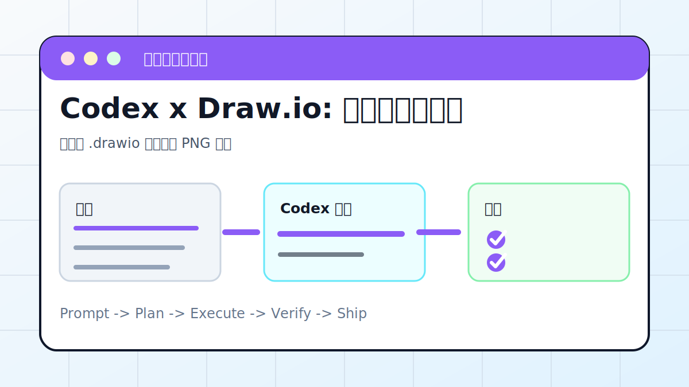

# Codex x Draw.io: 自动绘制架构图



## 案例目标

让 Codex 把文字说明转成可编辑架构图，而不是只给一张不可改的截图。

**最终产出**：可编辑 .drawio 架构图和 PNG 预览。

## 适合谁

要把系统结构、流程或业务链路画清楚的人。

## 准备输入

- 系统说明
- 模块列表
- 数据流或调用链
- 想要的图类型

## 推荐提示词

```text
请根据这份系统说明生成一张 draw.io 架构图。要求输出 .drawio 源文件和 PNG 预览；节点分为入口、服务、数据库、外部系统；连线标注数据流。
```

## 执行流程

1. 先让 Codex 提取实体、分组、连接关系。
2. 确认图类型：流程图、架构图、时序图或泳道图。
3. 生成 .drawio XML，并导出 PNG 预览。
4. 检查节点是否重叠、文字是否可读。
5. 把源文件和预览路径写到结果里。

## Codex 应该交付什么

- 一份可复查的执行摘要。
- 关键文件或产物路径。
- 运行过的验证命令。
- 未完成事项和风险说明。

## 验收标准

- .drawio 能用 draw.io 打开编辑。
- PNG 预览清晰。
- 节点、连线、方向和标签正确。

## 常见风险

- 只生成图片不可编辑。
- 节点太多没有层次。
- 连线方向和业务事实相反。

## 复盘模板

```text
目标是否完成：
改动 / 产物：
验证命令：
验证结果：
保留或安全要求：
下一步：
```

## 下一步

设计稿转前端继续看 figma-mcp.md。
