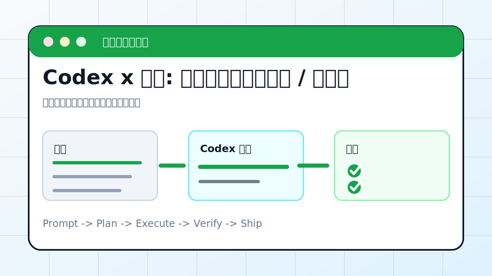

# Codex x 飞书: 一句话处理多维表格 / 机器人



## 案例目标

让 Codex 通过飞书工具读取、整理、写入协作数据，并保留操作日志。

**最终产出**：多维表格记录、机器人消息、处理日志。

## 适合谁

团队工作在飞书，希望 Codex 处理表格和通知的人。

## 准备输入

- 飞书应用权限
- 表格/多维表格链接
- 字段说明
- 写入规则

## 推荐提示词

```text
请读取这个飞书多维表格，按状态统计本周任务。要求：先只读字段和样例；输出统计表；如需写入新视图，先列出将创建的字段和视图。
```

## 执行流程

1. 确认飞书工具授权和目标 token。
2. 只读读取字段、视图和样例记录。
3. 设计统计口径和输出格式。
4. 写入前列出字段/记录/消息变更。
5. 执行后抽样核对。

## Codex 应该交付什么

- 一份可复查的执行摘要。
- 关键文件或产物路径。
- 运行过的验证命令。
- 未完成事项和风险说明。

## 验收标准

- 字段没有误删。
- 统计口径清楚。
- 机器人消息没有群发错误。
- 日志能追溯操作。

## 常见风险

- 权限过大。
- 误发群消息。
- 把私有表格内容写到公开仓库。

## 复盘模板

```text
目标是否完成：
改动 / 产物：
验证命令：
验证结果：
保留或安全要求：
下一步：
```

## 下一步

内容发布流程看 wechat-mp.md。
