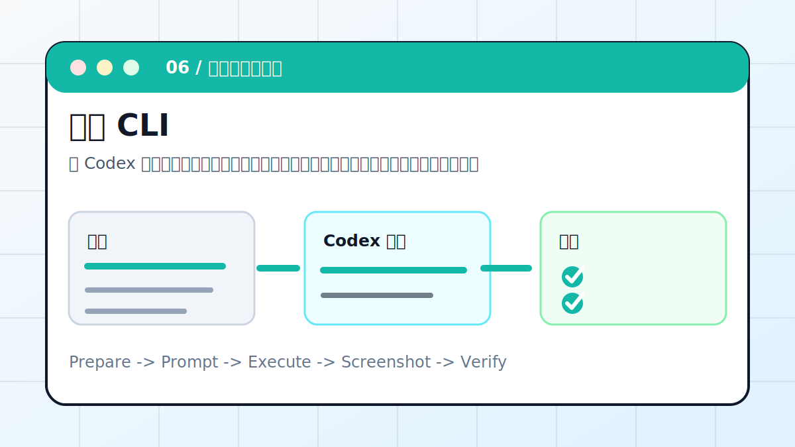

# Codex × 飞书 CLI：一句话处理飞书数据



用 Codex 读取飞书文档、多维表格或任务数据，完成统计、整理、通知草稿和写回前确认。

> 适合对象：团队日常工作在飞书，希望把表格、文档、通知流程自动化的人。
> 最终产出：统计表、处理日志、可确认的写回清单、消息草稿

## 案例目标

这个案例不是让 Codex “讲讲怎么做”，而是让它交付一个能复查的工作结果。你要把输入、权限边界、验收标准提前说清楚，让 Codex 按“计划 -> 执行 -> 截图/文件 -> 验收”的顺序推进。

## 准备清单

- 飞书 CLI 或 MCP 授权状态
- 文档、多维表格或任务链接
- 字段说明和统计口径
- 是否允许写入
- 消息发送对象和禁发范围

## 推荐入口

| 项目 | 建议 |
| --- | --- |
| 推荐入口 | CLI / Feishu / Base |
| 先做什么 | 让 Codex 只读检查输入和环境 |
| 再做什么 | 确认计划后执行生成、整理或验证 |
| 最后做什么 | 输出产物路径、截图、验证方法和风险说明 |

## 实操步骤

1. 确认工具授权和目标 token，但不要把凭据写进文档。
2. 先只读读取字段、视图和样例记录。
3. 让 Codex 复述统计口径，避免字段理解错。
4. 如需写入，先列出将创建或修改的字段、记录、视图、消息。
5. 执行后抽样核对，并保留操作日志。

## 可复制提示词

```text
请读取这个飞书多维表格，按状态统计本周任务。要求：先只读字段和 5 条样例；输出统计口径让我确认；如果需要写入新视图，先列出字段、视图和记录变更；不要群发消息，先生成消息草稿。
```

## 过程截图与配图

- 只读结果：字段和样例记录。
- 确认截图：写入前的变更清单。
- 完成截图：新增视图、统计表或消息草稿。

> 写教程或复盘时，建议把这些截图放在同名附件目录里。没有真实截图时，先保留“待补截图”占位，不要用与结果无关的装饰图冒充。

## 验收标准

- 字段没有误删或误改。
- 统计口径清楚，能复算。
- 消息没有发错群或发给错误对象。
- 日志不包含 token、cookie、密钥。

## 常见风险

- 飞书写操作前必须确认。
- 私有表格内容不要复制到公开仓库。
- 机器人消息先草稿后发送。

## 复盘模板

```text
目标是否完成：
输入材料：
Codex 做了什么：
产物路径或链接：
截图或证据：
验证命令 / 验证方法：
风险和未完成项：
下一步：
```

## 下一步

- 知识库落在 Notion 时看 Notion MCP。
- 内容发布流程看公众号案例。
