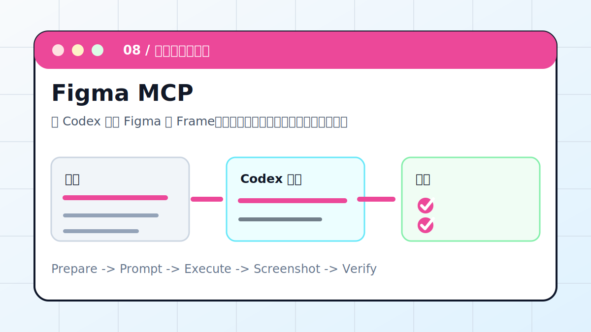

# Codex × Figma MCP：读懂设计稿



让 Codex 读取 Figma 的 Frame、组件、文本、颜色和间距，再转成前端实现计划和验收截图。

> 适合对象：需要从设计稿还原页面、组件或交互状态的前端和产品团队。
> 最终产出：设计解读、组件拆分、token 表、实现计划、截图对比清单

## 案例目标

这个案例不是让 Codex “讲讲怎么做”，而是让它交付一个能复查的工作结果。你要把输入、权限边界、验收标准提前说清楚，让 Codex 按“计划 -> 执行 -> 截图/文件 -> 验收”的顺序推进。

## 准备清单

- Figma 文件链接或节点 ID
- 可访问权限
- 技术栈和目标页面
- 设计稿中的关键状态
- 需要对比的屏幕尺寸

## 推荐入口

| 项目 | 建议 |
| --- | --- |
| 推荐入口 | MCP / IDE / 前端项目 |
| 先做什么 | 让 Codex 只读检查输入和环境 |
| 再做什么 | 确认计划后执行生成、整理或验证 |
| 最后做什么 | 输出产物路径、截图、验证方法和风险说明 |

## 实操步骤

1. 确认 Figma MCP 授权和节点范围。
2. 读取页面、Frame、组件层级和可见文本。
3. 提取颜色、字号、间距、圆角等设计 token。
4. 生成组件拆分、实现顺序和风险点。
5. 实现后用浏览器截图与设计稿对比。

## 可复制提示词

```text
请通过 Figma MCP 读取这个设计稿。要求：先总结页面结构、颜色、字体、间距、组件层级；再生成前端实现计划；不要臆测看不到的图层；实现后用截图和设计稿逐项对比。
```

## 过程截图与配图

- 读取结果：Frame 和组件层级。
- 实现计划：组件、样式、响应式断点。
- 验收截图：桌面和移动端对比。

> 写教程或复盘时，建议把这些截图放在同名附件目录里。没有真实截图时，先保留“待补截图”占位，不要用与结果无关的装饰图冒充。

## 验收标准

- 关键文本、布局和组件层级正确。
- 颜色、字号、间距接近设计稿。
- 移动端和桌面断点明确。
- 截图对比没有明显偏差。

## 常见风险

- 权限不足时不要猜隐藏图层。
- 不要用一套固定组件强行套所有设计。
- 复杂设计先实现主路径，再处理边缘状态。

## 复盘模板

```text
目标是否完成：
输入材料：
Codex 做了什么：
产物路径或链接：
截图或证据：
验证命令 / 验证方法：
风险和未完成项：
下一步：
```

## 下一步

- 需要自动检查网页入口看 Playwright MCP。
- 需要架构图看 Draw.io MCP。
