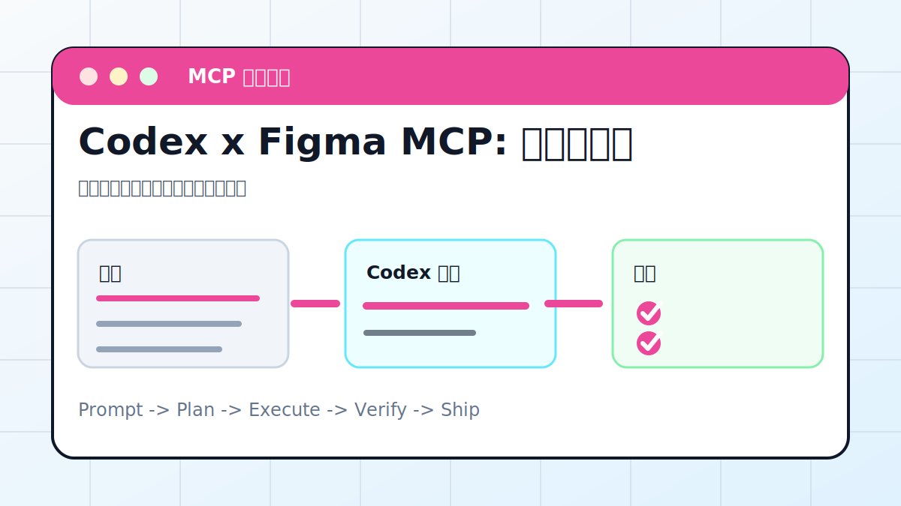

# Codex x Figma MCP: 读懂设计稿



## 案例目标

让 Codex 读取设计结构，提取尺寸、颜色、文本和组件层级，再生成实现计划。

**最终产出**：设计解读、组件拆分、前端实现计划。

## 适合谁

要从 Figma 设计稿还原页面或组件的人。

## 准备输入

- Figma 链接或节点 ID
- 设计目标
- 技术栈
- 验收截图

## 推荐提示词

```text
请通过 Figma MCP 读取这个设计稿。要求：先总结页面结构、颜色、字体、组件；再生成前端实现计划；不要臆测看不到的图层。
```

## 执行流程

1. 确认 Figma MCP 授权和节点范围。
2. 读取页面/Frame/组件层级。
3. 提取设计 token：颜色、字号、间距、圆角。
4. 生成组件拆分和实现顺序。
5. 实现后用截图与设计稿对比。

## Codex 应该交付什么

- 一份可复查的执行摘要。
- 关键文件或产物路径。
- 运行过的验证命令。
- 未完成事项和风险说明。

## 验收标准

- 关键文本和层级正确。
- 颜色字号接近设计。
- 移动端/桌面断点明确。
- 截图对比无明显偏差。

## 常见风险

- 设计稿权限不足。
- 隐藏图层被误读。
- 只生成代码不做视觉对比。

## 复盘模板

```text
目标是否完成：
改动 / 产物：
验证命令：
验证结果：
保留或安全要求：
下一步：
```

## 下一步

需要画架构图时看 drawio-diagram.md。
