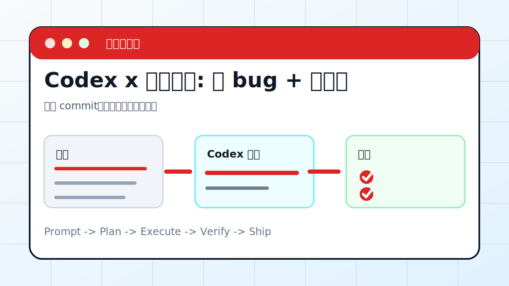

# Codex x 真实仓库: 修 bug + 补测试



## 案例目标

让 Codex 从复现开始，定位根因，做最小修复并补测试。

**最终产出**：修复 commit、测试结果、变更说明。

## 适合谁

真实项目里遇到 bug，希望 Codex 帮忙定位并修复的人。

## 准备输入

- 复现步骤
- 错误日志
- 相关文件
- 测试命令

## 推荐提示词

```text
请修复这个 bug。要求：先复现失败；说明根因；只改相关文件；补或更新测试；最后运行最快相关测试并汇报结果。
```

## 执行流程

1. 读取复现步骤和错误日志。
2. 运行最小复现命令。
3. 定位相关模块，不做大重构。
4. 实现最小修复。
5. 补测试并运行验证。

## Codex 应该交付什么

- 一份可复查的执行摘要。
- 关键文件或产物路径。
- 运行过的验证命令。
- 未完成事项和风险说明。

## 验收标准

- 失败能复现。
- 修复后测试通过。
- diff 只包含相关文件。
- 变更说明能解释根因。

## 常见风险

- 没复现就直接猜修。
- 只改测试掩盖 bug。
- 顺手重构扩大风险。

## 复盘模板

```text
目标是否完成：
改动 / 产物：
验证命令：
验证结果：
保留或安全要求：
下一步：
```

## 下一步

如果失败来自 CI，看 github-actions-ci.md。
