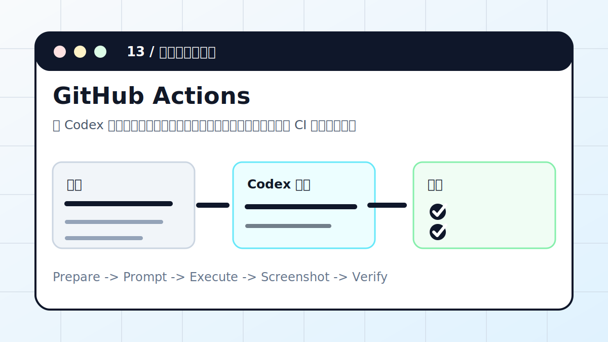

# Codex × GitHub Actions：CI 失败自动修复



让 Codex 读取失败日志、本地复现、做最小修复、补测试，并把 CI 回绿条件写清楚。

> 适合对象：PR 或 main 分支上 CI 失败，需要快速定位和修复的人。
> 最终产出：失败根因、修复 diff、本地验证命令、PR 说明

## 案例目标

这个案例不是让 Codex “讲讲怎么做”，而是让它交付一个能复查的工作结果。你要把输入、权限边界、验收标准提前说清楚，让 Codex 按“计划 -> 执行 -> 截图/文件 -> 验收”的顺序推进。

## 准备清单

- 仓库和 PR 链接
- 失败 job 名称
- 允许修改范围
- 本地复现命令
- 测试和提交规范

## 推荐入口

| 项目 | 建议 |
| --- | --- |
| 推荐入口 | GitHub Actions / PR / CLI |
| 先做什么 | 让 Codex 只读检查输入和环境 |
| 再做什么 | 确认计划后执行生成、整理或验证 |
| 最后做什么 | 输出产物路径、截图、验证方法和风险说明 |

## 实操步骤

1. 打开失败 job，定位真正失败的命令和第一处报错。
2. 在本地运行同一命令或最小复现命令。
3. 判断是代码、测试、依赖还是环境差异。
4. 做最小修复，必要时补测试。
5. 提交前运行相关检查，并说明远端 CI 回绿条件。

## 可复制提示词

```text
请检查这个 GitHub Actions 失败原因并修复。要求：先读取失败日志；本地复现；只改相关文件；修完跑最快相关测试；不要通过删除测试掩盖问题；最后给出 PR 说明和验证命令。
```

## 过程截图与配图

- 失败证据：job、命令、首个报错。
- 本地复现：同类失败输出。
- 修复证据：测试通过和 diff 摘要。

> 写教程或复盘时，建议把这些截图放在同名附件目录里。没有真实截图时，先保留“待补截图”占位，不要用与结果无关的装饰图冒充。

## 验收标准

- 本地能复现失败。
- 修复后相关测试通过。
- PR diff 没有无关改动。
- 远端 CI 回绿或明确等待条件。

## 常见风险

- 不要只看最后一行日志。
- 不要为了过 CI 删除测试或跳过检查。
- 环境变量缺失时，用占位说明，不要写真实密钥。

## 复盘模板

```text
目标是否完成：
输入材料：
Codex 做了什么：
产物路径或链接：
截图或证据：
验证命令 / 验证方法：
风险和未完成项：
下一步：
```

## 下一步

- 远程服务故障看云服务器修 Bug。
- GitHub issue/PR 管理看 GitHub MCP。
