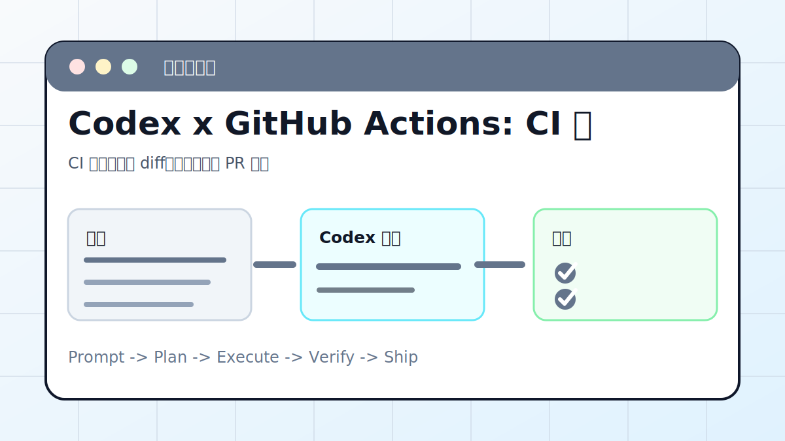

# Codex x GitHub Actions: CI 失败自动修复



## 案例目标

让 Codex 读取失败日志，复现失败，做最小修复，并让 CI 回绿。

**最终产出**：CI 根因、修复 diff、本地验证和 PR 说明。

## 适合谁

PR 里 CI 失败，需要 Codex 读取日志、定位问题、补测试的人。

## 准备输入

- PR 链接
- 失败 job
- 本地复现方式
- 允许修改范围

## 推荐提示词

```text
请检查 GitHub Actions 失败原因并修复。要求：先读取失败日志；本地复现；只改相关文件；修完跑对应测试；不要通过删除测试掩盖问题。
```

## 执行流程

1. 打开失败 job，定位失败命令和报错片段。
2. 在本地运行同一命令或最小复现命令。
3. 判断是代码问题、测试问题还是环境差异。
4. 做最小修复并补测试。
5. 提交前运行相关测试并总结 CI 回绿条件。

## Codex 应该交付什么

- 一份可复查的执行摘要。
- 关键文件或产物路径。
- 运行过的验证命令。
- 未完成事项和风险说明。

## 验收标准

- 本地复现失败。
- 修复后本地测试通过。
- 远端 CI 通过。
- PR diff 没有无关改动。

## 常见风险

- 只看最后一行日志。
- 为了过 CI 删除测试。
- 没处理环境变量或版本差异。

## 复盘模板

```text
目标是否完成：
改动 / 产物：
验证命令：
验证结果：
保留或安全要求：
下一步：
```

## 下一步

GitHub issue/PR 管理看 github-mcp.md。
