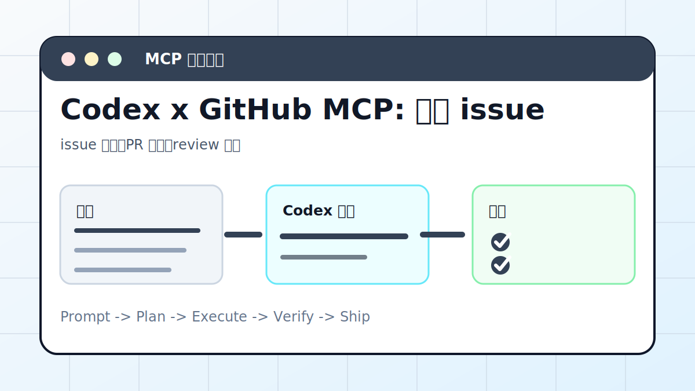

# Codex x GitHub MCP: 管理 issue 与 PR



## 案例目标

让 Codex 读取 issue/PR 上下文，生成分诊或变更建议，写操作前确认。

**最终产出**：issue 分诊、PR 摘要、review 建议。

## 适合谁

用 GitHub 管项目，需要批量整理 issue/PR 的团队。

## 准备输入

- GitHub MCP 配置
- 仓库名
- 任务范围
- 写操作权限

## 推荐提示词

```text
请通过 GitHub MCP 整理这个仓库最近 20 个 issue。要求：先只读分类；输出优先级、标签建议、负责人建议；不要直接关闭 issue。
```

## 执行流程

1. 确认 MCP 授权仓库范围。
2. 只读拉取 issue/PR 列表和标签。
3. 按 bug、feature、question、docs 分类。
4. 生成可复制评论或标签建议。
5. 写入前列出具体操作。

## Codex 应该交付什么

- 一份可复查的执行摘要。
- 关键文件或产物路径。
- 运行过的验证命令。
- 未完成事项和风险说明。

## 验收标准

- 分类依据清楚。
- 没有误关闭 issue。
- 评论不泄露内部信息。
- 操作记录可追溯。

## 常见风险

- 权限过大导致误操作。
- 没有读完整讨论就下结论。
- 把自动建议当最终决策。

## 复盘模板

```text
目标是否完成：
改动 / 产物：
验证命令：
验证结果：
保留或安全要求：
下一步：
```

## 下一步

CI 失败自动修复看 github-actions-ci.md。
