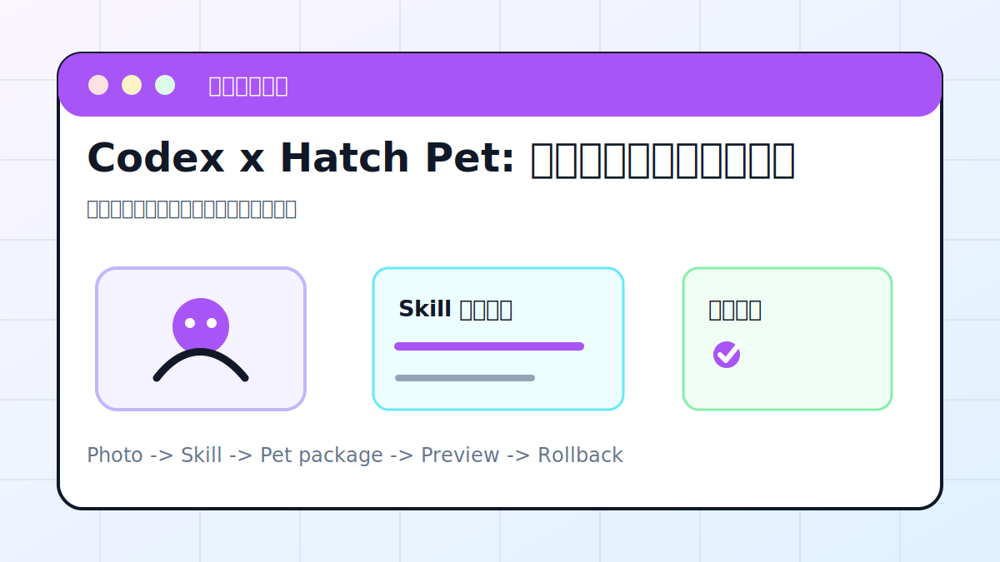

# Codex x Hatch Pet: 用一张照片生成专属桌面宠物



## 案例目标

让 Codex 使用 Hatch Pet 类技能生成可安装的桌面宠物素材，并完成安装、预览和回退说明。

**最终产出**：宠物素材包、安装说明、桌面工作台预览。

## 适合谁

想把 Codex 桌面 App 做得更有个人感、同时学习 Skill 安装流程的人。

## 准备输入

- 一张参考照片或风格描述
- 宠物名称
- 希望的动作状态
- Codex App Skills 页面

## 推荐提示词

```text
请帮我制作一个 Codex 桌面宠物。输入是一张参考照片和宠物名称。要求：先检查是否已安装 Hatch Pet 相关 skill；没有就说明安装步骤；生成宠物素材包、安装路径和预览截图；不要覆盖已有宠物素材。
```

## 执行流程

1. 确认当前 Codex App 是否支持宠物和 Skills。
2. 准备参考照片或风格描述，避免使用未经授权的人像。
3. 让 Codex 检查 Hatch Pet skill 是否可用。
4. 生成宠物素材包和元信息。
5. 安装后重载 Skills 或 App，并在桌面预览。
6. 记录回退方式：删除哪个素材目录、如何恢复默认设置。

## Codex 应该交付什么

- 宠物素材包路径。
- 安装或启用步骤。
- 预览截图或状态说明。
- 回退方式和风险说明。

## 验收标准

- 宠物名称和素材包路径明确。
- 安装后在 Codex App 中可见。
- 预览状态正常，不遮挡主要工作区。
- 回退步骤写清楚。

## 常见风险

- 参考照片版权或肖像权不清。
- 覆盖已有宠物素材。
- 只生成图片，没有生成可安装包。

## 复盘模板

```text
目标是否完成：
素材包路径：
安装状态：
预览结果：
回退方式：
下一步：
```

## 下一步

想在手机端跟进任务时继续看 android-remote.md。
