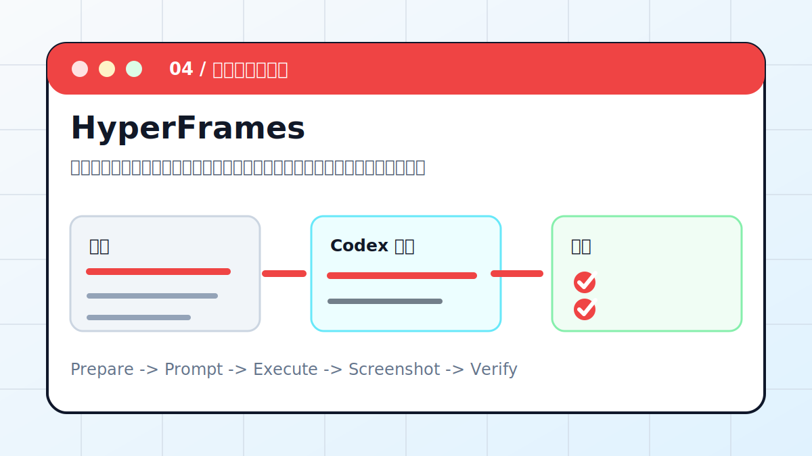

# Codex × HyperFrames：用代码生成动画视频



把讲稿先拆成分镜，再用代码生成可预览动画，最后导出成短视频或演示片段。

> 适合对象：想把知识点、产品流程、课程内容做成短视频的人。
> 最终产出：分镜表、动画工程、预览截图、MP4 导出文件

## 案例目标

这个案例不是让 Codex “讲讲怎么做”，而是让它交付一个能复查的工作结果。你要把输入、权限边界、验收标准提前说清楚，让 Codex 按“计划 -> 执行 -> 截图/文件 -> 验收”的顺序推进。

## 准备清单

- 主题和讲稿
- 目标平台：横屏、竖屏或方屏
- 时长和节奏
- 品牌色、字体、图片素材
- 本地可运行的动画项目或导出工具

## 推荐入口

| 项目 | 建议 |
| --- | --- |
| 推荐入口 | App / CLI / 动画工程 |
| 先做什么 | 让 Codex 只读检查输入和环境 |
| 再做什么 | 确认计划后执行生成、整理或验证 |
| 最后做什么 | 输出产物路径、截图、验证方法和风险说明 |

## 实操步骤

1. 让 Codex 先把讲稿切成 5 到 8 个镜头。
2. 确认每个镜头的主视觉、字幕和转场。
3. 生成可预览的网页动画或代码工程。
4. 用截图检查关键帧，先改画面再导出。
5. 导出 MP4 并检查时长、画幅、字幕位置。

## 可复制提示词

```text
请把这段讲稿做成 60 秒竖屏动画视频。要求：先输出分镜表；每个镜头包含画面、字幕、动效和时长；确认后生成可预览代码工程；字幕不能遮挡主体；导出前先给关键帧截图。
```

## 过程截图与配图

- 分镜表：证明不是直接盲目生成。
- 关键帧截图：封面、转折、结尾。
- 导出信息：分辨率、时长、文件路径。

> 写教程或复盘时，建议把这些截图放在同名附件目录里。没有真实截图时，先保留“待补截图”占位，不要用与结果无关的装饰图冒充。

## 验收标准

- 视频能播放，时长和画幅符合要求。
- 字幕完整且不遮挡主体。
- 源工程可再次修改。
- 素材来源和版权状态清楚。

## 常见风险

- 不要一开始就导出长视频，返工成本很高。
- 字幕字数过多会直接毁掉观感。
- 使用人物、品牌或音乐素材前先确认授权。

## 复盘模板

```text
目标是否完成：
输入材料：
Codex 做了什么：
产物路径或链接：
截图或证据：
验证命令 / 验证方法：
风险和未完成项：
下一步：
```

## 下一步

- 需要演示稿时看 PPT Skill。
- 需要配图整理到知识库时看 Obsidian。
