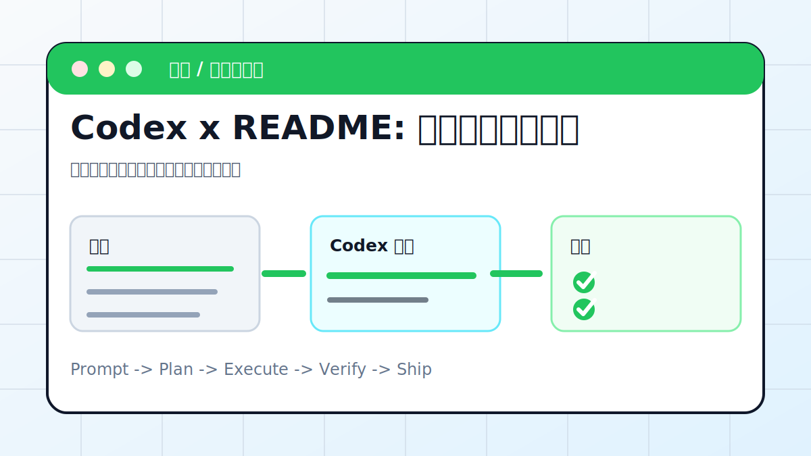

# Codex 实战案例库



这里是教程站的主体。入门教程解决“怎么装、怎么买、怎么配置”，案例库解决“装好以后能做什么”。这一版案例不再只放一句提示词，而是按真实工作流写：场景图、准备输入、提示词、执行步骤、验收标准和风险提醒。

## 怎么选第一个案例

| 目标 | 推荐案例 | 原因 |
| --- | --- | --- |
| 先看到成果 | [README 变网页](readme-to-web.md) | 能练到读文件、改页面、本地预览和链接检查 |
| 想发布到公网 | [静态网页部署](deploy-static-site.md) | 能把本地产物变成可分享链接 |
| 做内容表达 | [PPT](ppt-skill.md)、[Draw.io](drawio-diagram.md)、[动画视频](animation-video.md) | 适合课程、公众号、汇报和产品演示 |
| 整理知识库 | [Obsidian](obsidian.md)、[AI Wiki](ai-wiki.md)、[Notion MCP](notion-mcp.md) | 适合把资料变成长期资产 |
| 接工具 | [Playwright MCP](playwright-mcp.md)、[Figma MCP](figma-mcp.md)、[数据库 MCP](database-mcp.md) | 适合让 Codex 访问外部系统 |
| 真实开发 | [真实仓库修 bug](fix-real-repo.md)、[GitHub Actions CI](github-actions-ci.md) | 适合修复、测试和 PR 工作流 |
| 自动化 | [网页采集](web-scrape.md)、[服务器巡检](server-patrol.md) | 适合稳定重复任务 |

## 案例成熟度

| 状态 | 案例 | 说明 |
| --- | --- | --- |
| 完整闭环 | README 变网页、静态站部署、PPT、Playwright MCP、真实仓库修 bug、GitHub Actions CI | 有明确输入、操作步骤、验收和风险 |
| 工具接入 | Draw.io、Figma MCP、Notion MCP、数据库 MCP、GitHub MCP、Chrome 控制、飞书 | 重点在授权、权限、读写边界和验证 |
| 工作流沉淀 | Obsidian、AI Wiki、网页采集、服务器巡检、公众号、研究报告 | 重点在去重、日志、来源和复盘 |
| 场景扩展 | 动画视频、安卓远程、文献综述 | 适合根据你的真实素材继续扩写 |

## 24 个案例清单

| 编号 | 分类 | 案例 | 产出 | 适合谁 |
| --- | --- | --- | --- | --- |
| 01 | 入门 / 快速出效果 | [README: 把文档一键变网页 ](readme-to-web.md) | 一个能打开、能预览、能发布的静态首页 | 第一次想看到 Codex 真实产出的用户 |
| 02 | 入门 / 快速出效果 | [一键部署: 静态网页发布到公网 ](deploy-static-site.md) | 一个可分享的公网链接 | 已经有静态网页，想把结果发给别人看的用户 |
| 03 | 内容生产与表达 | [PPT: 一句话生成演示文稿 ](ppt-skill.md) | 可编辑 PPTX、页级大纲、封面图建议 | 需要把文章、课程、会议纪要变成演示文稿的人 |
| 04 | 内容生产与表达 | [Draw.io: 自动绘制架构图 ](drawio-diagram.md) | 可编辑 .drawio 架构图和 PNG 预览 | 要把系统结构、流程或业务链路画清楚的人 |
| 05 | 内容生产与表达 | [数据可视化: CSV 变图表 ](data-viz.md) | 图表、分析说明、可复现脚本 | 手里有 CSV/Excel，想快速看趋势和异常的人 |
| 06 | 内容生产与表达 | [动画视频: 用代码生成动画 ](animation-video.md) | 网页动画、MP4 或分镜脚本 | 想把概念、流程或课程内容做成短视频的人 |
| 07 | 知识库与个人工作台 | [Obsidian: 知识库自动整理与配图 ](obsidian.md) | 结构化笔记、索引页、配图建议或图片文件 | 用 Obsidian 管理文章、课程、资料的人 |
| 08 | 知识库与个人工作台 | [AI Wiki: 搭建主题知识库 ](ai-wiki.md) | 主题目录、概念页、证据表、阅读路线 | 要把零散资料整理成一套可复用知识库的人 |
| 09 | 知识库与个人工作台 | [Notion MCP: 打通知识空间 ](notion-mcp.md) | Notion 页面、数据库整理、同步流程 | 团队资料和项目知识都在 Notion 的用户 |
| 10 | MCP 工具集成 | [Playwright MCP: 让 AI 操控浏览器 ](playwright-mcp.md) | 浏览器截图、交互记录、问题报告 | 要测试网页、填表、截图、检查交互的人 |
| 11 | MCP 工具集成 | [Figma MCP: 读懂设计稿 ](figma-mcp.md) | 设计解读、组件拆分、前端实现计划 | 要从 Figma 设计稿还原页面或组件的人 |
| 12 | MCP 工具集成 | [数据库 MCP: 自然语言查数据 ](database-mcp.md) | SQL、查询结果、报表和风险说明 | 想用自然语言查业务数据但需要可审计的人 |
| 13 | MCP 工具集成 | [GitHub MCP: 管理 issue 与 PR ](github-mcp.md) | issue 分诊、PR 摘要、review 建议 | 用 GitHub 管项目，需要批量整理 issue/PR 的团队 |
| 14 | 浏览器与自动化 | [Chrome: 直接控制浏览器 ](chrome-control.md) | 基于用户登录态的页面操作记录和截图 | 需要使用自己 Chrome 登录态完成网页检查的人 |
| 15 | 浏览器与自动化 | [网页采集: 定时抓取并入库 ](web-scrape.md) | 采集脚本、state.json、日志和数据文件 | 要长期跟踪公开网页更新的人 |
| 16 | 团队与协作工具 | [飞书: 一句话处理多维表格 / 机器人 ](feishu-bot.md) | 多维表格记录、机器人消息、处理日志 | 团队工作在飞书，希望 Codex 处理表格和通知的人 |
| 17 | 团队与协作工具 | [公众号: 内容采集与发布流程 ](wechat-mp.md) | 公众号草稿包、封面建议、发布检查清单 | 要把资料整理成公众号文章并进入发布流程的人 |
| 18 | 工程与运维 | [真实仓库: 修 bug + 补测试 ](fix-real-repo.md) | 修复 commit、测试结果、变更说明 | 真实项目里遇到 bug，希望 Codex 帮忙定位并修复的人 |
| 19 | 工程与运维 | [云服务器: 远程定位并修复 Bug ](remote-bug-fix.md) | 排障记录、修复补丁、回滚方案 | 线上或测试服务器出现问题，需要远程排障的人 |
| 20 | 工程与运维 | [GitHub Actions: CI 失败自动修复 ](github-actions-ci.md) | CI 根因、修复 diff、本地验证和 PR 说明 | PR 里 CI 失败，需要 Codex 读取日志、定位问题、补测试的人 |
| 21 | 工程与运维 | [定时巡检: 服务器自动巡检 + 通知 ](server-patrol.md) | 巡检脚本、日报、告警规则、通知记录 | 需要每天检查服务器健康状态的人 |
| 22 | 移动与个性化 | [安卓手机: 扫码连接,远程操控 ](android-remote.md) | 手机端连接状态、远程任务操作记录 | 想在手机上跟进桌面 Codex 任务的人 |
| 23 | 非开发 / 研究 | [文献综述: 整理成可复核证据表 ](literature-review.md) | PICO、证据表、局限性和引用清单 | 需要做论文、医学或行业研究综述的人 |
| 24 | 非开发 / 研究 | [资料调研: 网络信息整理成报告 ](research-report.md) | 带来源的调研报告、证据表、待验证清单 | 要快速了解行业、产品、竞品或政策的人 |

## 每个案例怎么读

每篇案例都按同一套结构写：

1. 看场景图，先理解输入、Codex 执行和验收。
2. 准备输入材料，不要把 token、cookie、私钥发给 Codex。
3. 复制推荐提示词，再按你的实际路径和目标替换。
4. 让 Codex 先计划，再执行。
5. 用验收标准检查结果，而不是只听它说“完成了”。
6. 用复盘模板记录改动、验证和下一步。

## 通用提示词模板

```text
目标：请完成 [具体任务]。
上下文：相关文件在 [路径]，参考资料是 [链接或文件]。
约束：保留现有链接，不泄露密钥，不新增无关依赖。
完成标准：产出 [文件/页面/报告]，并运行 [验证命令]。
请先检查当前项目结构，再给出计划，确认后执行。
```

## 安全提醒

- 涉及第三方中转、API Key、飞书、GitHub、数据库时，优先使用环境变量或 MCP 授权，不要把密钥写进文档。
- 会写入外部系统的案例，先只读，再列变更清单，最后人工确认写操作。
- 会发布、群发、删除、重置、支付的操作，不做自动执行。

## 参考来源

本案例库参考官方 Codex manual 中关于 App、CLI、MCP、Skills、AGENTS.md、自动化、权限和沙盒的说明，并结合本仓库现有国内站入口和教程结构重新组织。
