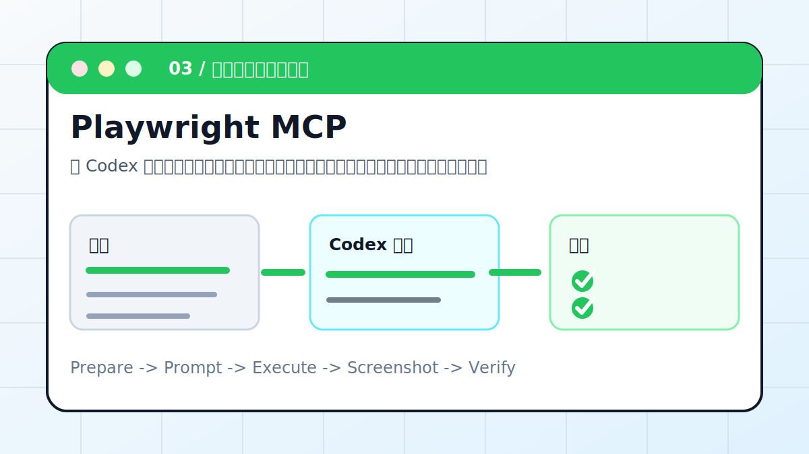

# Codex 实战案例库

这一页按参考站的组织方式重做：先给出案例总览，再给出 16 个主案例清单、怎么选择先看哪个、案例成熟度，最后保留本仓库额外扩展案例。内容是原创整理，不复制对方站点原文；结构上对齐“真实场景 + 推荐入口 + 验证重点”的读法。

## 案例地图

| 使用目标 | 推荐案例 | 学到什么 |
| --- | --- | --- |
| 快速看到成品 | [PPT Skill](ppt-skill.md)、[Draw.io](drawio-diagram.md)、[静态部署](deploy-static-site.md) | 从 prompt 到可交付文件 |
| 学会 MCP | [Playwright MCP](playwright-mcp.md)、[Figma MCP](figma-mcp.md)、[Notion MCP](notion-mcp.md) | 授权、读取、写入边界 |
| 整理知识和内容 | [Obsidian](obsidian.md)、[AI Wiki](ai-wiki.md)、[文献综述](literature-review.md) | 索引、证据表、来源追踪 |
| 工程自动化 | [云服务器修 Bug](remote-bug-fix.md)、[GitHub Actions CI](github-actions-ci.md) | 日志、复现、最小修复 |
| 移动与个性化 | [Hatch Pet](hatch-pet.md)、[安卓手机远程操控](android-remote.md) | App、Skill、远程协同 |

## 16 个主案例清单

| 编号 | 案例 | 核心场景 | 推荐入口 | 验证重点 |
| --- | --- | --- | --- | --- |
| 01 | [Codex x PPT Skill：一句话生成演示文稿](ppt-skill.md) | 用 Skill 生成 PPT 初稿 | App / CLI / PPTX | PPTX 能打开，文字不溢出 |
| 02 | [Codex x Draw.io：AI 自动绘制架构图](drawio-diagram.md) | 把系统说明变成可编辑架构图 | Draw.io / diagrams.net | 源文件可编辑，连线方向正确 |
| 03 | [Codex x Playwright MCP：让 AI 操控浏览器](playwright-mcp.md) | 打开网页、点击入口、截图检查 | MCP / Browser | 截图存在，链接和控制台检查通过 |
| 04 | [Codex x 动画视频：用代码生成动画](animation-video.md) | 把讲稿变成分镜和视频工程 | 网页动画 / MP4 | 字幕不遮挡，时长和画幅正确 |
| 05 | [Codex x Obsidian：知识库自动整理与配图](obsidian.md) | 整理 Vault、建立索引、补配图 | Obsidian / Markdown | 原文保留，索引和图片路径可用 |
| 06 | [Codex x 飞书：一句话处理多维表格](feishu-bot.md) | 读取表格、统计数据、生成通知 | 飞书 / Base | 字段不误删，写入前确认 |
| 07 | [Codex x AI Wiki：搭建主题知识库](ai-wiki.md) | 把资料组织成概念页和证据表 | Obsidian / Wiki | 结论能追到来源 |
| 08 | [Codex x Figma MCP：读懂设计稿](figma-mcp.md) | 读取设计稿并拆成前端实现计划 | Figma MCP | 颜色、字号、组件层级可复核 |
| 09 | [Codex x Notion MCP：打通知识空间](notion-mcp.md) | 整理 Notion 页面和数据库 | Notion MCP | 写操作前列变更清单 |
| 10 | [Codex x 静态部署：网页一键发布到公网](deploy-static-site.md) | 把本地网页部署为可分享链接 | GitHub Pages / Vercel | 公网 200，资源路径正确 |
| 11 | [Codex x 云服务器：远程定位并修复 Bug](remote-bug-fix.md) | 读日志、复现、最小修复、回滚 | SSH / 服务器 | 不泄露密钥，有回滚方案 |
| 12 | [Codex x Chrome：让 AI 直接控制浏览器](chrome-control.md) | 使用用户登录态做网页检查 | Chrome / 登录态 | 不触发删除、发布、支付 |
| 13 | [Codex x GitHub Actions：CI 失败自动修复](github-actions-ci.md) | 读取失败日志并让 CI 回绿 | GitHub Actions | 本地复现，远端 CI 通过 |
| 14 | [Codex x 文献综述：整理成可复核证据表](literature-review.md) | 把研究问题拆成 PICO 和证据表 | PDF / DOI / Evidence | 每条结论有来源和局限性 |
| 15 | [Codex x Hatch Pet：用一张照片生成专属宠物](hatch-pet.md) | 生成并安装 Codex 桌面宠物 | Skill / App | 素材包路径和回退方式明确 |
| 16 | [Codex x 安卓手机：扫码连接，远程操控](android-remote.md) | 手机端跟进桌面 Codex 任务 | ChatGPT App / Desktop | 账号一致，连接状态正常 |

## 怎么选择先看哪个

- 想快速看到效果：先看 [PPT Skill](ppt-skill.md)、[Draw.io](drawio-diagram.md)、[静态部署](deploy-static-site.md)。
- 想学习 MCP：先看 [Playwright MCP](playwright-mcp.md)、[Figma MCP](figma-mcp.md)、[Notion MCP](notion-mcp.md)。
- 想整理长期知识：先看 [Obsidian](obsidian.md)、[AI Wiki](ai-wiki.md)、[文献综述](literature-review.md)。
- 想做工程自动化：先看 [云服务器远程修 Bug](remote-bug-fix.md)、[GitHub Actions CI 自动修复](github-actions-ci.md)。
- 想理解浏览器控制能力：先看 [Playwright MCP](playwright-mcp.md) 和 [Chrome 浏览器控制](chrome-control.md)。
- 想做个人工作台：先看 [Hatch Pet](hatch-pet.md) 和 [安卓手机远程操控](android-remote.md)。

## 案例成熟度

| 状态 | 案例 | 说明 |
| --- | --- | --- |
| 已形成完整流程 | PPT Skill、Playwright MCP、Obsidian、飞书、文献综述、Hatch Pet、安卓远程、远程修 Bug、GitHub Actions CI | 有明确安装、使用步骤或完整操作链路 |
| 偏工具接入教程 | Draw.io、Figma MCP、Notion MCP、静态部署、Chrome 控制 | 重点在接入方式、典型任务和安全边界 |
| 偏场景展示 | 动画视频、AI Wiki | 适合根据真实素材继续深化 |
| 扩展补充 | README 变网页、数据可视化、数据库、GitHub、网页采集、公众号、真实仓库、服务器巡检、资料调研 | 本仓库额外补充，适合后续继续加厚 |

## 扩展案例

| 编号 | 案例 | 用途 |
| --- | --- | --- |
| E01 | [README 变网页](readme-to-web.md) | 第一次看到 Codex 产出 |
| E02 | [CSV 变图表](data-viz.md) | 把数据变成图表和分析 |
| E03 | [数据库 MCP](database-mcp.md) | 自然语言查数据 |
| E04 | [GitHub MCP](github-mcp.md) | 整理 issue 与 PR |
| E05 | [网页采集](web-scrape.md) | 定时抓公开网页并去重 |
| E06 | [公众号流程](wechat-mp.md) | 生成草稿包和发布检查清单 |
| E07 | [真实仓库修 bug](fix-real-repo.md) | 复现、修复和补测试 |
| E08 | [服务器巡检](server-patrol.md) | 生成巡检报告和告警规则 |
| E09 | [资料调研报告](research-report.md) | 带来源和待验证清单的报告 |

## 每篇案例怎么读

1. 先看场景图，理解输入、Codex 执行和验收。
2. 对照“准备输入”，把路径、链接、文件名换成自己的。
3. 复制推荐提示词，但保留自己的安全约束。
4. 让 Codex 先计划，再执行。
5. 用验收标准检查结果，而不是只听它说“完成了”。
6. 用复盘模板记录产物、验证命令和下一步。

## 安全提醒

- 涉及第三方中转、API Key、飞书、GitHub、数据库时，优先使用环境变量或 MCP 授权，不要把密钥写进文档。
- 会写入外部系统的案例，先只读，再列变更清单，最后人工确认写操作。
- 会发布、群发、删除、重置、支付的操作，不做自动执行。
