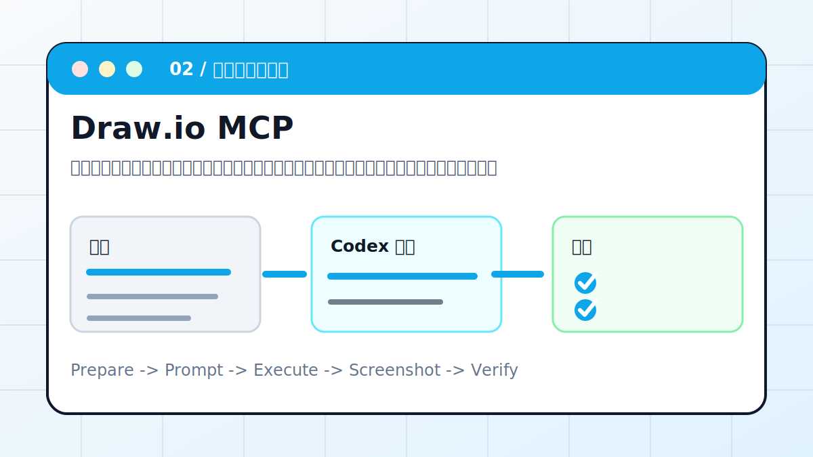
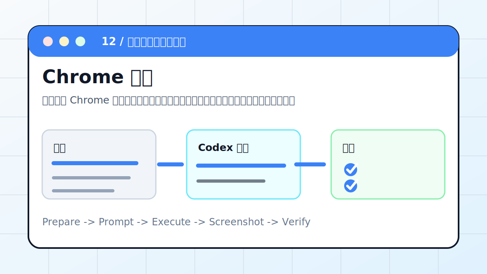
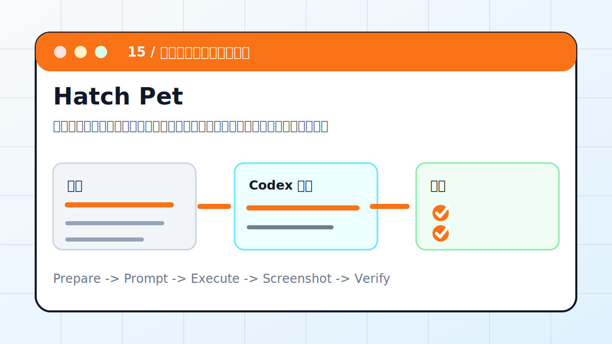
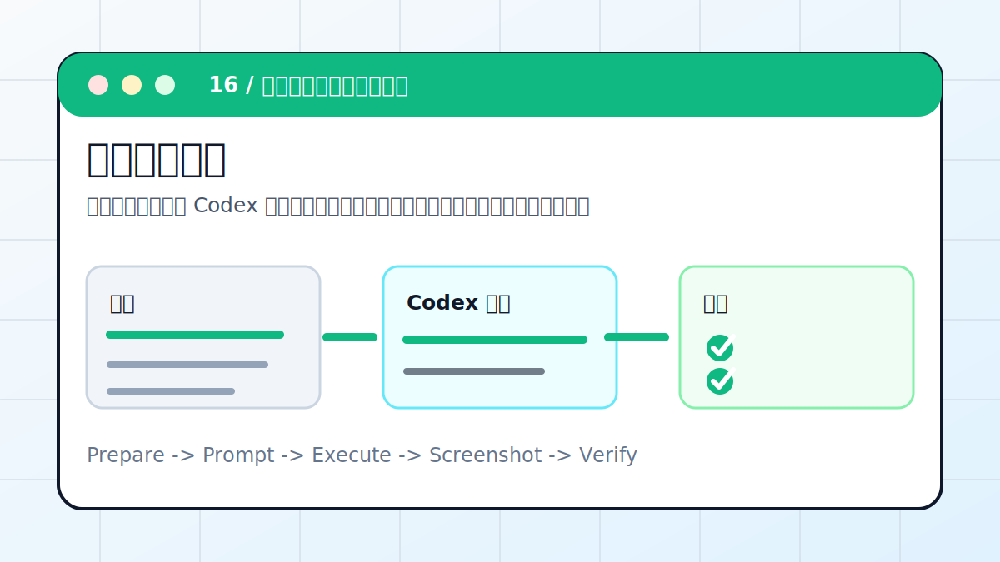

# Codex 实战案例库

这一页按参考站的组织方式重做：先给出案例总览，再给出 16 个主案例清单、怎么选择先看哪个、案例成熟度，最后保留本仓库额外扩展案例。正文全部是原创整理，不复制第三方站点原文；结构上对齐“真实场景 + 推荐入口 + 过程截图 + 验证重点”的读法。

## 当前案例概览

| 类型 | 已收录案例 | 适合学习什么 |
| --- | --- | --- |
| 内容生产与表达 | PPT Skill、Draw.io MCP、HyperFrames | 把一句话需求转成演示稿、架构图和动画视频 |
| 知识库与个人工作台 | Obsidian、LLM Wiki、Notion MCP | 在笔记、Wiki、知识空间中组织资料和生成内容 |
| 浏览器与前端自动化 | Playwright MCP、Chrome 控制 | 让 Codex 操作网页、检查页面、保存截图 |
| 设计与协作平台 | Figma MCP、飞书 CLI | 读取设计稿、处理协作数据、连接团队工具 |
| 发布与工程运维 | DKFile、云服务器修 Bug、GitHub Actions | 从本地发布到远程排障和 CI 修复 |
| 医学科研与个性化 | 临床文献综述、Hatch Pet、安卓远程 | 证据整理、桌面宠物、手机协同 |

## 16 个案例清单

| 编号 | 案例 | 核心场景 | 推荐入口 | 验证重点 |
| --- | --- | --- | --- | --- |
| 01 | [Codex × PPT Skill：一句话生成演示文稿](ppt-skill-walkthrough.md) | 把一段文章、课程主题或会议纪要交给 Codex，让它先拆页级大纲，再生成可编辑 PPTX，并做版式检查。 | 桌面 App / CLI / PPTX Skill | PPTX 能打开且每页元素可编辑。 |
| 02 | [Codex × Draw.io MCP：AI 自动绘制架构图](drawio-mcp.md) | 把系统说明、业务链路或接口调用关系转成可编辑架构图，而不是只生成一张不可修改的图片。 | App / MCP / diagrams.net | .drawio 文件能被 diagrams.net 打开。 |
| 03 | [Codex × Playwright MCP：让 AI 操控浏览器](playwright-mcp.md) | 让 Codex 真正打开页面、点击入口、保存截图，并基于页面状态而不是想象来判断结果。 | App / MCP / Browser | 截图文件存在且能看到目标页面。 |
| 04 | [Codex × HyperFrames：用代码生成动画视频](hyperframes-animation.md) | 把讲稿先拆成分镜，再用代码生成可预览动画，最后导出成短视频或演示片段。 | App / CLI / 动画工程 | 视频能播放，时长和画幅符合要求。 |
| 05 | [Codex × Obsidian：在知识库中自动生成配图](obsidian-codex.md) | 让 Codex 在本地 Vault 中整理笔记、建立索引，并为重点文章生成配图提示词或图片文件。 | CLI / Obsidian / Markdown | 原文和附件没有丢失。 |
| 06 | [Codex × 飞书 CLI：一句话处理飞书数据](feishu-cli-codex.md) | 用 Codex 读取飞书文档、多维表格或任务数据，完成统计、整理、通知草稿和写回前确认。 | CLI / Feishu / Base | 字段没有误删或误改。 |
| 07 | [Codex × LLM Wiki：在 Obsidian 中搭建 AI 知识库](llm-wiki-codex.md) | 把零散资料整理成概念页、证据表、阅读路线和待补问题，形成可以长期维护的主题 Wiki。 | Obsidian / CLI / Markdown | 目录层级清楚，新增资料有放置规则。 |
| 08 | [Codex × Figma MCP：读懂设计稿](figma-mcp-codex.md) | 让 Codex 读取 Figma 的 Frame、组件、文本、颜色和间距，再转成前端实现计划和验收截图。 | MCP / IDE / 前端项目 | 关键文本、布局和组件层级正确。 |
| 09 | [Codex × Notion MCP：打通知识空间](notion-mcp-codex.md) | 通过 Notion MCP 读取页面和数据库，整理项目资料、知识卡片和任务视图，并在写入前列出变更。 | MCP / Notion | 字段没有被误删。 |
| 10 | [Codex × DKFile：网页一键发布到公网](dkfile-deploy-codex.md) | 让 Codex 检查静态站结构、资源路径和入口链接，再通过 DKFile 或同类静态托管发布到公网。 | CLI / 静态托管 / GitHub Pages | 公网 URL 返回 200。 |
| 11 | [Codex × 云服务器：远程定位并修复 Bug](remote-bug-fix.md) | 让 Codex 通过只读检查、日志分析、最小复现和可回滚补丁定位远程服务问题。 | CLI / SSH / Remote | 错误可复现，修复后消失。 |
| 12 | [Codex × Chrome：让 AI 直接控制浏览器](chrome-browser-plugin.md) | 使用用户 Chrome 登录态完成明确、低风险的网页检查，例如后台筛选、页面核对、截图留证。 | Chrome / 登录态 / 浏览器插件 | 截图显示正确页面。 |
| 13 | [Codex × GitHub Actions：CI 失败自动修复](github-actions-ci-fix.md) | 让 Codex 读取失败日志、本地复现、做最小修复、补测试，并把 CI 回绿条件写清楚。 | GitHub Actions / PR / CLI | 本地能复现失败。 |
| 14 | [Codex × 临床文献综述：把医学问题整理成证据表](clinical-literature-review.md) | 把临床或科研问题拆成 PICO、纳入排除标准、逐篇证据表和局限性，而不是生成不可追溯的泛泛综述。 | App / CLI / PDF / DOI | 每条结论有来源。 |
| 15 | [Codex × Hatch Pet：用一张照片生成专属宠物](hatch-pet-photo.md) | 用一张参考照片或风格描述生成桌面宠物素材包，并记录安装、预览和回退方式。 | 桌面 App / Hatch Pet / Skill | 宠物名称、素材包路径、安装路径明确。 |
| 16 | [Codex × 安卓手机：扫码连接，远程操控](android-remote-control.md) | 让安卓手机和桌面 Codex 任务保持协同，能查看线程、补充指令、确认低风险动作。 | ChatGPT App / Desktop App / 同一账号 | 手机能看到目标任务或明确失败原因。 |

## 配图版入口

### 01 PPT Skill

- 入口：[Codex × PPT Skill：一句话生成演示文稿](ppt-skill-walkthrough.md)
- 场景：把一段文章、课程主题或会议纪要交给 Codex，让它先拆页级大纲，再生成可编辑 PPTX，并做版式检查。
- 产出：页级大纲、可编辑 PPTX、封面与配图建议、导出复查记录

### 02 Draw.io MCP

- 入口：[Codex × Draw.io MCP：AI 自动绘制架构图](drawio-mcp.md)
- 场景：把系统说明、业务链路或接口调用关系转成可编辑架构图，而不是只生成一张不可修改的图片。
- 产出：.drawio 源文件、PNG 预览、节点关系说明

### 03 Playwright MCP

- 入口：[Codex × Playwright MCP：让 AI 操控浏览器](playwright-mcp.md)
- 场景：让 Codex 真正打开页面、点击入口、保存截图，并基于页面状态而不是想象来判断结果。
- 产出：交互记录、截图、控制台错误、坏链接清单

### 04 HyperFrames

- 入口：[Codex × HyperFrames：用代码生成动画视频](hyperframes-animation.md)
- 场景：把讲稿先拆成分镜，再用代码生成可预览动画，最后导出成短视频或演示片段。
- 产出：分镜表、动画工程、预览截图、MP4 导出文件

### 05 Obsidian

- 入口：[Codex × Obsidian：在知识库中自动生成配图](obsidian-codex.md)
- 场景：让 Codex 在本地 Vault 中整理笔记、建立索引，并为重点文章生成配图提示词或图片文件。
- 产出：索引页、摘要、标签、配图提示词或图片路径

### 06 飞书 CLI

- 入口：[Codex × 飞书 CLI：一句话处理飞书数据](feishu-cli-codex.md)
- 场景：用 Codex 读取飞书文档、多维表格或任务数据，完成统计、整理、通知草稿和写回前确认。
- 产出：统计表、处理日志、可确认的写回清单、消息草稿

### 07 LLM Wiki

- 入口：[Codex × LLM Wiki：在 Obsidian 中搭建 AI 知识库](llm-wiki-codex.md)
- 场景：把零散资料整理成概念页、证据表、阅读路线和待补问题，形成可以长期维护的主题 Wiki。
- 产出：主题目录、概念页模板、证据表、阅读路线、待办清单

### 08 Figma MCP

- 入口：[Codex × Figma MCP：读懂设计稿](figma-mcp-codex.md)
- 场景：让 Codex 读取 Figma 的 Frame、组件、文本、颜色和间距，再转成前端实现计划和验收截图。
- 产出：设计解读、组件拆分、token 表、实现计划、截图对比清单

### 09 Notion MCP

- 入口：[Codex × Notion MCP：打通知识空间](notion-mcp-codex.md)
- 场景：通过 Notion MCP 读取页面和数据库，整理项目资料、知识卡片和任务视图，并在写入前列出变更。
- 产出：页面整理方案、数据库字段映射、写入清单、同步复盘

### 10 DKFile

- 入口：[Codex × DKFile：网页一键发布到公网](dkfile-deploy-codex.md)
- 场景：让 Codex 检查静态站结构、资源路径和入口链接，再通过 DKFile 或同类静态托管发布到公网。
- 产出：可访问公网链接、部署清单、资源路径检查结果

### 11 云服务器修 Bug

- 入口：[Codex × 云服务器：远程定位并修复 Bug](remote-bug-fix.md)
- 场景：让 Codex 通过只读检查、日志分析、最小复现和可回滚补丁定位远程服务问题。
- 产出：排障记录、根因、修复补丁、验证结果、回滚方案

### 12 Chrome 控制

- 入口：[Codex × Chrome：让 AI 直接控制浏览器](chrome-browser-plugin.md)
- 场景：使用用户 Chrome 登录态完成明确、低风险的网页检查，例如后台筛选、页面核对、截图留证。
- 产出：页面操作记录、截图、问题清单、安全边界说明

### 13 GitHub Actions

- 入口：[Codex × GitHub Actions：CI 失败自动修复](github-actions-ci-fix.md)
- 场景：让 Codex 读取失败日志、本地复现、做最小修复、补测试，并把 CI 回绿条件写清楚。
- 产出：失败根因、修复 diff、本地验证命令、PR 说明

### 14 临床文献综述

- 入口：[Codex × 临床文献综述：把医学问题整理成证据表](clinical-literature-review.md)
- 场景：把临床或科研问题拆成 PICO、纳入排除标准、逐篇证据表和局限性，而不是生成不可追溯的泛泛综述。
- 产出：PICO、检索策略、证据表、结论边界、引用清单

### 15 Hatch Pet

- 入口：[Codex × Hatch Pet：用一张照片生成专属宠物](hatch-pet-photo.md)
- 场景：用一张参考照片或风格描述生成桌面宠物素材包，并记录安装、预览和回退方式。
- 产出：宠物素材包、安装路径、预览截图、回退说明

### 16 安卓远程操控

- 入口：[Codex × 安卓手机：扫码连接，远程操控](android-remote-control.md)
- 场景：让安卓手机和桌面 Codex 任务保持协同，能查看线程、补充指令、确认低风险动作。
- 产出：连接状态、配对检查表、远程操作记录、失败排查表

## 怎么选择先看哪个

- 想快速看到效果：先看 [PPT Skill](ppt-skill-walkthrough.md)、[Draw.io MCP](drawio-mcp.md)、[DKFile](dkfile-deploy-codex.md)。
- 想学习 MCP：先看 [Playwright MCP](playwright-mcp.md)、[Figma MCP](figma-mcp-codex.md)、[Notion MCP](notion-mcp-codex.md)。
- 想把 Codex 放进知识工作流：先看 [Obsidian](obsidian-codex.md)、[LLM Wiki](llm-wiki-codex.md)、[飞书 CLI](feishu-cli-codex.md)。
- 想做医学科研资料整理：先看 [临床文献综述](clinical-literature-review.md)，重点学习如何把事实、推断和安全边界分开。
- 想优化桌面工作台体验：先看 [Hatch Pet](hatch-pet-photo.md)，了解如何生成和安装自定义宠物素材包。
- 想用手机跟进桌面任务：先看 [安卓手机远程操控](android-remote-control.md)，重点检查账号、网络和授权状态。
- 想做工程自动化：先看 [云服务器远程修 Bug](remote-bug-fix.md)、[GitHub Actions CI 自动修复](github-actions-ci-fix.md)。

## 案例成熟度

| 状态 | 案例 | 说明 |
| --- | --- | --- |
| 已形成完整流程 | PPT Skill、Playwright MCP、Obsidian、飞书 CLI、临床文献综述、Hatch Pet、安卓远程、远程修 Bug、GitHub Actions | 有明确准备清单、提示词、验证和风险边界 |
| 偏工具接入教程 | Draw.io MCP、Figma MCP、Notion MCP、DKFile、Chrome 控制 | 重点在授权、读取、写入和安全边界 |
| 偏创作工作流 | HyperFrames、LLM Wiki | 适合根据真实素材继续加截图和产出文件 |
| 扩展补充 | README 变网页、数据可视化、数据库、GitHub、采集、公众号、真实仓库、巡检、调研 | 本仓库额外保留，后续可继续加厚 |

## 扩展案例

| 编号 | 案例 | 用途 |
| --- | --- | --- |
| E01 | [README 变网页](readme-to-web.md) | 第一次看到 Codex 产出 |
| E02 | [CSV 变图表](data-viz.md) | 把数据变成图表和分析 |
| E03 | [数据库 MCP](database-mcp.md) | 自然语言查数据 |
| E04 | [GitHub MCP](github-mcp.md) | 整理 issue 与 PR |
| E05 | [网页采集](web-scrape.md) | 定时抓公开网页并去重 |
| E06 | [公众号流程](wechat-mp.md) | 生成草稿包和发布检查清单 |
| E07 | [真实仓库修 bug](fix-real-repo.md) | 复现、修复和补测试 |
| E08 | [服务器巡检](server-patrol.md) | 生成巡检报告和告警规则 |
| E09 | [资料调研报告](research-report.md) | 带来源和待验证清单的报告 |

## 每篇案例怎么读

1. 先看场景图，理解输入、Codex 执行和验收。
2. 对照“准备清单”，把路径、链接、文件名换成自己的。
3. 复制推荐提示词，但保留自己的安全约束。
4. 让 Codex 先计划，再执行。
5. 用验收标准检查结果，而不是只听它说“完成了”。
6. 用复盘模板记录产物、验证命令和下一步。

## 安全提醒

- 涉及第三方中转、API Key、飞书、GitHub、数据库时，优先使用环境变量或 MCP 授权，不要把密钥写进文档。
- 会写入外部系统的案例，先只读，再列变更清单，最后人工确认写操作。
- 会发布、群发、删除、重置、支付的操作，不做自动执行。
