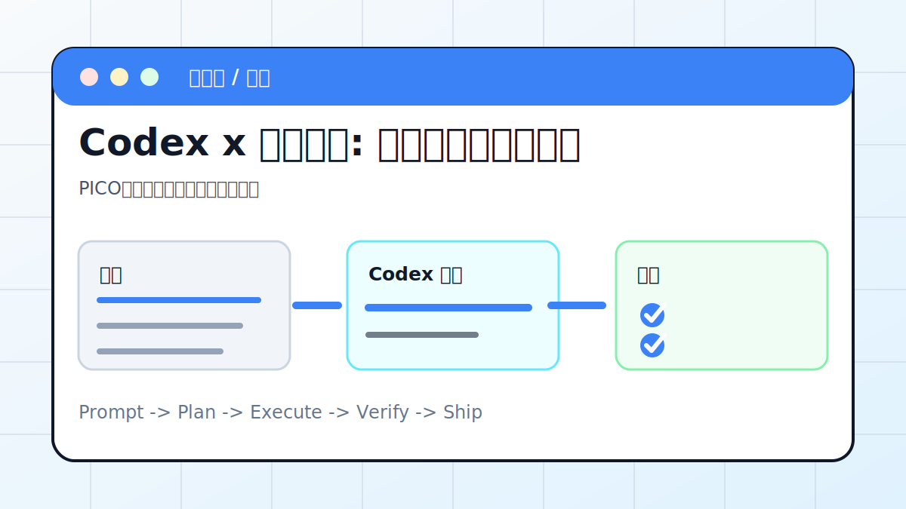

# Codex x 文献综述: 整理成可复核证据表



## 案例目标

让 Codex 把研究问题拆成可复核证据表，而不是生成不可追溯的泛泛综述。

**最终产出**：PICO、证据表、局限性和引用清单。

## 适合谁

需要做论文、医学或行业研究综述的人。

## 准备输入

- 研究问题
- 文献 PDF 或 DOI
- 纳入排除标准
- 输出格式

## 推荐提示词

```text
请把这些文献整理成证据表。要求：先写 PICO；逐篇提取研究设计、样本、干预、结局、主要结果、局限性；所有结论必须能追到来源。
```

## 执行流程

1. 明确研究问题和纳入排除标准。
2. 读取文献元信息和摘要。
3. 逐篇提取证据字段。
4. 生成证据表和结论分级。
5. 写局限性和不能下结论的部分。

## Codex 应该交付什么

- 一份可复查的执行摘要。
- 关键文件或产物路径。
- 运行过的验证命令。
- 未完成事项和风险说明。

## 验收标准

- 每条结论有来源。
- 没有编造不存在的研究。
- 局限性单独列出。
- 高风险领域不替代专业建议。

## 常见风险

- 把摘要当全文。
- 医学建议越界。
- 引用格式不可复查。

## 复盘模板

```text
目标是否完成：
改动 / 产物：
验证命令：
验证结果：
保留或安全要求：
下一步：
```

## 下一步

普通资料调研看 research-report.md。
