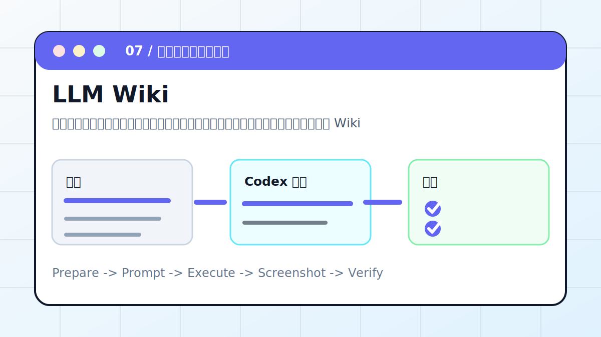

# Codex × LLM Wiki：在 Obsidian 中搭建 AI 知识库



把零散资料整理成概念页、证据表、阅读路线和待补问题，形成可以长期维护的主题 Wiki。

> 适合对象：想把资料沉淀成可复用知识资产的人。
> 最终产出：主题目录、概念页模板、证据表、阅读路线、待办清单

## 案例目标

这个案例不是让 Codex “讲讲怎么做”，而是让它交付一个能复查的工作结果。你要把输入、权限边界、验收标准提前说清楚，让 Codex 按“计划 -> 执行 -> 截图/文件 -> 验收”的顺序推进。

## 准备清单

- 主题边界
- 资料文件、链接或 PDF
- 目标读者
- 输出目录
- 引用和证据格式

## 推荐入口

| 项目 | 建议 |
| --- | --- |
| 推荐入口 | Obsidian / CLI / Markdown |
| 先做什么 | 让 Codex 只读检查输入和环境 |
| 再做什么 | 确认计划后执行生成、整理或验证 |
| 最后做什么 | 输出产物路径、截图、验证方法和风险说明 |

## 实操步骤

1. 盘点资料来源，区分已读、待读和低可信来源。
2. 设计 Wiki 目录：概念、案例、工具、证据、问题。
3. 生成概念页模板，并固定“定义、观点、证据、关联、待补”。
4. 逐条抽取证据，不把推断写成事实。
5. 建立总索引、阅读路线和下次更新规则。

## 可复制提示词

```text
请把这些资料整理成一个 LLM Wiki。要求：先设计目录；每个概念页包含定义、关键观点、证据来源、相关链接和待补问题；生成总索引和阅读路线；不确定的信息标为待验证，不能编造成事实。
```

## 过程截图与配图

- 资料清单：来源、类型、可信度。
- 目录截图：主题树和索引页。
- 证据表：每条结论对应来源。

> 写教程或复盘时，建议把这些截图放在同名附件目录里。没有真实截图时，先保留“待补截图”占位，不要用与结果无关的装饰图冒充。

## 验收标准

- 目录层级清楚，新增资料有放置规则。
- 每个结论能追到来源。
- 不确定项被标记为待验证。
- Wiki 能在下一次更新时继续扩展。

## 常见风险

- 不要把未经验证的文章写成事实。
- 不要把页面切得太碎导致维护困难。
- 不要省略来源表。

## 复盘模板

```text
目标是否完成：
输入材料：
Codex 做了什么：
产物路径或链接：
截图或证据：
验证命令 / 验证方法：
风险和未完成项：
下一步：
```

## 下一步

- 本地 Vault 整理看 Obsidian。
- 团队资料在 Notion 时看 Notion MCP。
