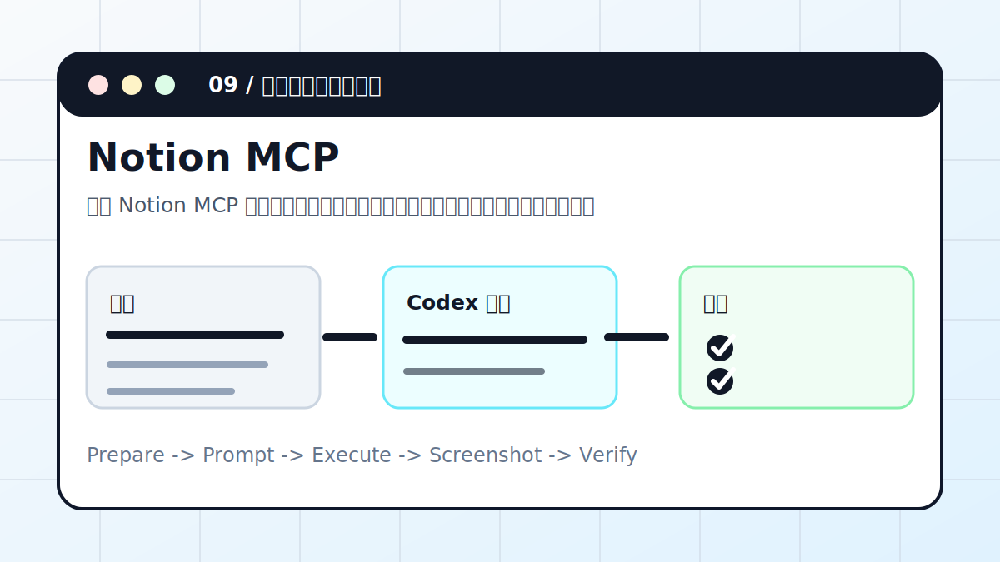

# Codex × Notion MCP：打通知识空间



通过 Notion MCP 读取页面和数据库，整理项目资料、知识卡片和任务视图，并在写入前列出变更。

> 适合对象：团队资料、项目知识和内容计划都在 Notion 的用户。
> 最终产出：页面整理方案、数据库字段映射、写入清单、同步复盘

## 案例目标

这个案例不是让 Codex “讲讲怎么做”，而是让它交付一个能复查的工作结果。你要把输入、权限边界、验收标准提前说清楚，让 Codex 按“计划 -> 执行 -> 截图/文件 -> 验收”的顺序推进。

## 准备清单

- Notion MCP 授权状态
- 页面或数据库 ID
- 字段说明
- 整理目标
- 不允许读取或写入的页面范围

## 推荐入口

| 项目 | 建议 |
| --- | --- |
| 推荐入口 | MCP / Notion |
| 先做什么 | 让 Codex 只读检查输入和环境 |
| 再做什么 | 确认计划后执行生成、整理或验证 |
| 最后做什么 | 输出产物路径、截图、验证方法和风险说明 |

## 实操步骤

1. 确认 MCP 已连接，并只给必要页面权限。
2. 先只读获取页面、数据库结构和样例记录。
3. 让 Codex 设计字段整理方案和视图。
4. 写操作前输出完整变更清单。
5. 执行后抽样检查页面内容和数据库记录。

## 可复制提示词

```text
请通过 Notion MCP 整理这个项目数据库。要求：先只读列出字段和 5 条样例；设计状态、优先级、负责人、截止时间视图；写入前列出将修改的页面和字段；不要读取未授权页面。
```

## 过程截图与配图

- 只读截图：字段和样例。
- 变更清单：新增字段、视图或页面。
- 完成截图：整理后的数据库视图。

> 写教程或复盘时，建议把这些截图放在同名附件目录里。没有真实截图时，先保留“待补截图”占位，不要用与结果无关的装饰图冒充。

## 验收标准

- 字段没有被误删。
- 新增页面格式一致。
- 写入记录能追溯。
- 敏感页面没有被读取或公开。

## 常见风险

- MCP 权限越小越好。
- 批量写入前必须确认。
- 不要把私有 Notion 内容复制到公开仓库。

## 复盘模板

```text
目标是否完成：
输入材料：
Codex 做了什么：
产物路径或链接：
截图或证据：
验证命令 / 验证方法：
风险和未完成项：
下一步：
```

## 下一步

- 飞书数据处理看飞书 CLI。
- 本地知识库看 Obsidian。
