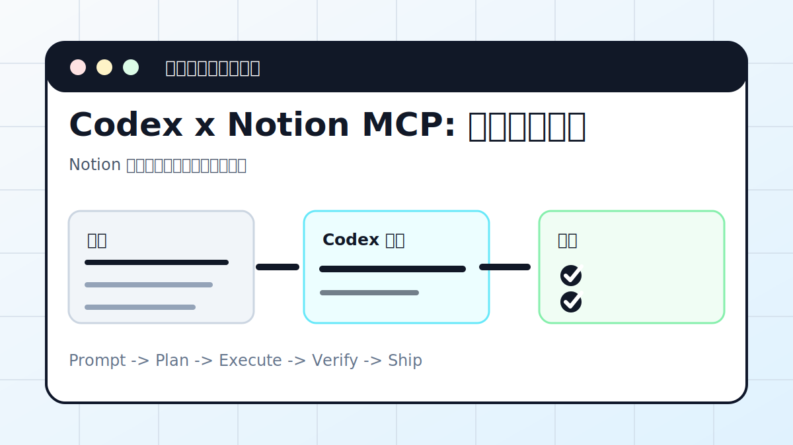

# Codex x Notion MCP: 打通知识空间



## 案例目标

让 Codex 通过 MCP 读取和整理 Notion 内容，必要时写入结构化页面。

**最终产出**：Notion 页面、数据库整理、同步流程。

## 适合谁

团队资料和项目知识都在 Notion 的用户。

## 准备输入

- Notion MCP 配置
- 页面或数据库 ID
- 整理目标
- 字段说明

## 推荐提示词

```text
请通过 Notion MCP 整理这个项目数据库。要求：先只读列出字段和样例；设计状态、优先级、负责人视图；写入前列出将修改的页面。
```

## 执行流程

1. 确认 Notion MCP 已连接并具备授权。
2. 先只读获取页面/数据库结构。
3. 设计字段整理方案和视图。
4. 写操作前让 Codex 列出变更清单。
5. 执行后抽样检查页面内容。

## Codex 应该交付什么

- 一份可复查的执行摘要。
- 关键文件或产物路径。
- 运行过的验证命令。
- 未完成事项和风险说明。

## 验收标准

- 字段没有被误删。
- 新增页面格式一致。
- 写入记录能追溯。
- 敏感页面没有被读取或公开。

## 常见风险

- MCP 权限过大。
- 批量写入前没有确认。
- 把私有资料复制到公开仓库。

## 复盘模板

```text
目标是否完成：
改动 / 产物：
验证命令：
验证结果：
保留或安全要求：
下一步：
```

## 下一步

团队协作表格可看 feishu-bot.md。
