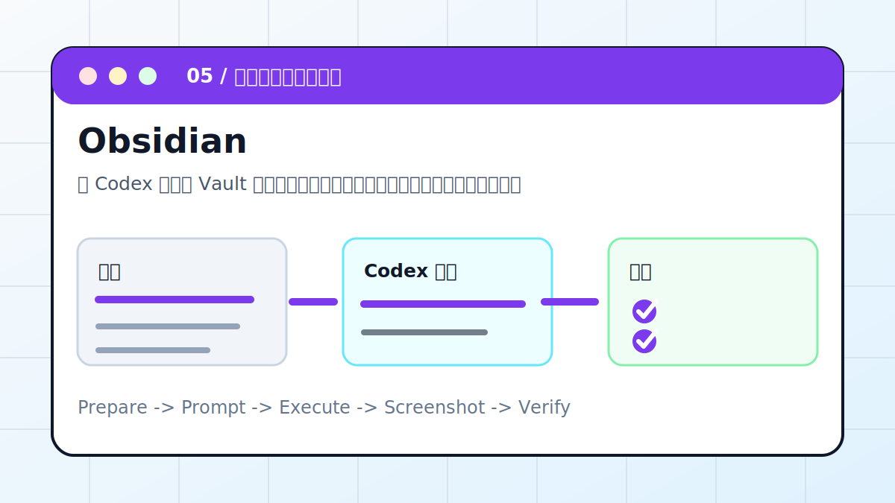

# Codex × Obsidian：在知识库中自动生成配图



让 Codex 在本地 Vault 中整理笔记、建立索引，并为重点文章生成配图提示词或图片文件。

> 适合对象：用 Obsidian 管理文章、课程、资料和长期知识的人。
> 最终产出：索引页、摘要、标签、配图提示词或图片路径

## 案例目标

这个案例不是让 Codex “讲讲怎么做”，而是让它交付一个能复查的工作结果。你要把输入、权限边界、验收标准提前说清楚，让 Codex 按“计划 -> 执行 -> 截图/文件 -> 验收”的顺序推进。

## 准备清单

- Vault 绝对路径
- 要整理的目录
- 命名规则和标签规则
- 是否允许移动文件
- 图片生成或图床规则

## 推荐入口

| 项目 | 建议 |
| --- | --- |
| 推荐入口 | CLI / Obsidian / Markdown |
| 先做什么 | 让 Codex 只读检查输入和环境 |
| 再做什么 | 确认计划后执行生成、整理或验证 |
| 最后做什么 | 输出产物路径、截图、验证方法和风险说明 |

## 实操步骤

1. 先只读扫描 Vault，识别目录、附件和命名习惯。
2. 让 Codex 列出拟整理文件、目标目录和不确定项。
3. 确认后生成索引页、摘要、标签和反向链接。
4. 配图时先生成提示词或新图片，不覆盖原附件。
5. 用 Obsidian 打开检查链接、图片和标签。

## 可复制提示词

```text
请整理这个 Obsidian Vault 的 02 Articles 目录。要求：先只读扫描并列出计划；保留原文；为每篇生成摘要、标签、索引链接和配图提示词；不要移动未确认的附件；完成后检查 Markdown 图片路径能否显示。
```

## 过程截图与配图

- 整理前：目录树截图或文件清单。
- 整理中：拟移动/新增清单。
- 整理后：索引页和图片显示截图。

> 写教程或复盘时，建议把这些截图放在同名附件目录里。没有真实截图时，先保留“待补截图”占位，不要用与结果无关的装饰图冒充。

## 验收标准

- 原文和附件没有丢失。
- 索引页能跳到每篇笔记。
- 标签、分类和文件名一致。
- 图片路径在 Obsidian 中可显示。

## 常见风险

- 不要自动重命名大量旧文件。
- 不要覆盖用户手写摘要。
- 图床、图片生成和附件搬运要保留原始来源。

## 复盘模板

```text
目标是否完成：
输入材料：
Codex 做了什么：
产物路径或链接：
截图或证据：
验证命令 / 验证方法：
风险和未完成项：
下一步：
```

## 下一步

- 想搭主题知识库继续看 LLM Wiki。
- 团队知识在 Notion 时看 Notion MCP。
