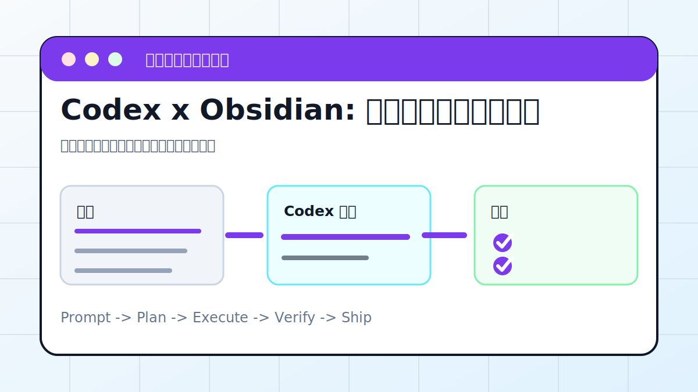

# Codex x Obsidian: 知识库自动整理与配图



## 案例目标

让 Codex 按目录规则整理笔记，建立索引，并为重点内容补图。

**最终产出**：结构化笔记、索引页、配图建议或图片文件。

## 适合谁

用 Obsidian 管理文章、课程、资料的人。

## 准备输入

- Obsidian Vault 路径
- 要整理的文件夹
- 分类规则
- 是否需要配图

## 推荐提示词

```text
请整理这个 Obsidian Vault 的 02 Articles 目录。要求：保留原文；按主题建立索引页；为每篇生成摘要、标签和配图提示词；不要移动未确认的附件。
```

## 执行流程

1. 只读扫描 Vault，识别目录结构和命名习惯。
2. 列出拟整理文件和目标目录，先让用户确认。
3. 生成索引页、摘要、标签和反向链接。
4. 处理图片时保留原附件，不覆盖。
5. 检查 Obsidian 链接和 Markdown 图片路径。

## Codex 应该交付什么

- 一份可复查的执行摘要。
- 关键文件或产物路径。
- 运行过的验证命令。
- 未完成事项和风险说明。

## 验收标准

- 原文还在。
- 索引页能跳到各笔记。
- 标签和分类一致。
- 图片路径在 Obsidian 中可显示。

## 常见风险

- 误移动附件导致图片丢失。
- 把临时草稿当正式文章。
- 覆盖用户原文。

## 复盘模板

```text
目标是否完成：
改动 / 产物：
验证命令：
验证结果：
保留或安全要求：
下一步：
```

## 下一步

想做主题知识库继续看 ai-wiki.md。
