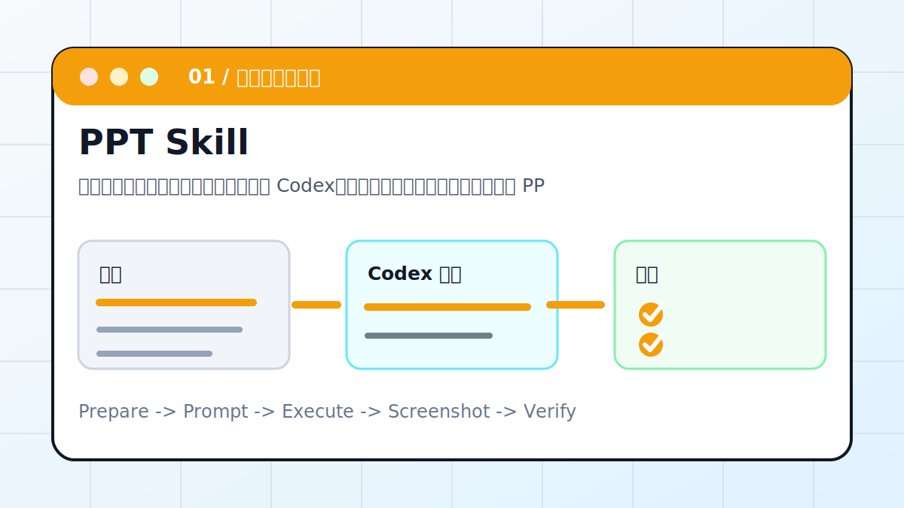

# Codex × PPT Skill：一句话生成演示文稿



把一段文章、课程主题或会议纪要交给 Codex，让它先拆页级大纲，再生成可编辑 PPTX，并做版式检查。

> 适合对象：需要把文字材料快速变成演示稿、课程课件、路演稿的人。
> 最终产出：页级大纲、可编辑 PPTX、封面与配图建议、导出复查记录

## 案例目标

这个案例不是让 Codex “讲讲怎么做”，而是让它交付一个能复查的工作结果。你要把输入、权限边界、验收标准提前说清楚，让 Codex 按“计划 -> 执行 -> 截图/文件 -> 验收”的顺序推进。

## 准备清单

- 原文、主题或会议纪要
- 目标观众和使用场景
- 页数、比例、风格偏好
- 必须保留的品牌色、Logo 或数据
- 输出路径和文件名

## 推荐入口

| 项目 | 建议 |
| --- | --- |
| 推荐入口 | 桌面 App / CLI / PPTX Skill |
| 先做什么 | 让 Codex 只读检查输入和环境 |
| 再做什么 | 确认计划后执行生成、整理或验证 |
| 最后做什么 | 输出产物路径、截图、验证方法和风险说明 |

## 实操步骤

1. 先让 Codex 读取材料并列出 10 到 12 页大纲，不急着生成文件。
2. 确认每页只承载一个观点，删除“讲稿式长段落”。
3. 要求 Codex 生成 PPTX，并把文字、图片、图表保持为可编辑对象。
4. 导出预览或截图检查封面、目录页、数据页和结尾页。
5. 让 Codex 汇报文件路径、使用的素材来源和复查命令。

## 可复制提示词

```text
请把这份材料整理成 12 页横版 PPT。要求：先输出页级大纲让我确认；每页只保留一个核心观点；生成可编辑 PPTX；标题、正文、配图建议分层；最后检查文字不要溢出，并给出文件路径和复查方法。
```

## 过程截图与配图

- 生成前：材料目录或原文截图。
- 生成中：页级大纲截图。
- 生成后：PPT 封面、目录、数据页、结尾页截图。

> 写教程或复盘时，建议把这些截图放在同名附件目录里。没有真实截图时，先保留“待补截图”占位，不要用与结果无关的装饰图冒充。

## 验收标准

- PPTX 能打开且每页元素可编辑。
- 标题和正文没有被裁切。
- 图片来源、生成方式或占位说明清楚。
- 最后一页包含行动建议或总结，而不是空白页。

## 常见风险

- 不要让 Codex 把整篇文章塞进每一页。
- 不要使用来源不明的人像、品牌图和商业素材。
- 涉及客户资料时，只在本地处理，不贴到公开仓库。

## 复盘模板

```text
目标是否完成：
输入材料：
Codex 做了什么：
产物路径或链接：
截图或证据：
验证命令 / 验证方法：
风险和未完成项：
下一步：
```

## 下一步

- 需要流程图时继续看 Draw.io MCP。
- 需要把 PPT 发布成网页时继续看 DKFile/静态部署。
