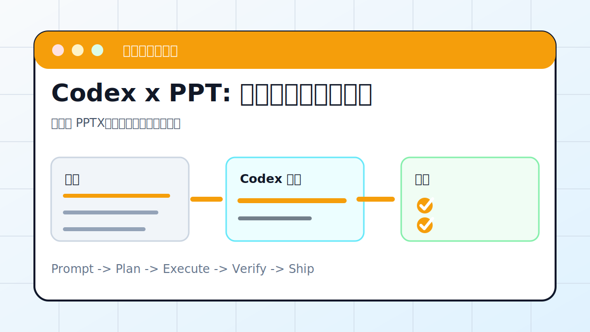

# Codex x PPT: 一句话生成演示文稿



## 案例目标

让 Codex 先提炼结构，再生成可编辑 PPTX，并检查文字不溢出。

**最终产出**：可编辑 PPTX、页级大纲、封面图建议。

## 适合谁

需要把文章、课程、会议纪要变成演示文稿的人。

## 准备输入

- 主题或原文
- 目标观众
- 页数
- 风格偏好
- 素材图片或数据

## 推荐提示词

```text
请把这篇文章整理成 12 页横版 PPT。第一页是标题，最后一页是行动建议；每页有标题、三条以内要点和配图建议；生成可编辑 PPTX，并检查文字不要溢出。
```

## 执行流程

1. 让 Codex 先输出页级大纲，不急着生成文件。
2. 确认每页只承载一个观点。
3. 生成 PPTX，并把图片、图表、文字分层可编辑。
4. 导出或截图检查每页文字是否溢出。
5. 让 Codex 汇报文件路径和复查方法。

## Codex 应该交付什么

- 一份可复查的执行摘要。
- 关键文件或产物路径。
- 运行过的验证命令。
- 未完成事项和风险说明。

## 验收标准

- PPTX 能打开。
- 每页标题和正文可编辑。
- 文字没有被裁切。
- 图片来源或生成方式说明清楚。

## 常见风险

- 直接生成导致页数失控。
- 文字过多像 Word 文档。
- 图片版权或来源不清。

## 复盘模板

```text
目标是否完成：
改动 / 产物：
验证命令：
验证结果：
保留或安全要求：
下一步：
```

## 下一步

需要流程图时继续看 drawio-diagram.md。
