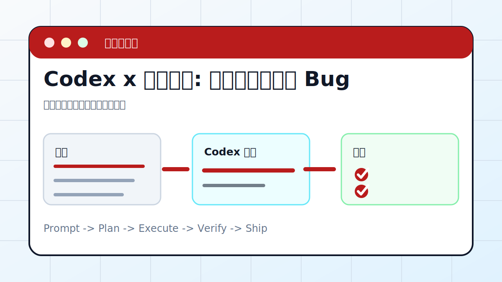

# Codex × 云服务器：远程定位并修复 Bug



让 Codex 通过只读检查、日志分析、最小复现和可回滚补丁定位远程服务问题。

> 适合对象：测试或线上服务器出现 500、启动失败、任务异常的人。
> 最终产出：排障记录、根因、修复补丁、验证结果、回滚方案

## 案例目标

这个案例不是让 Codex “讲讲怎么做”，而是让它交付一个能复查的工作结果。你要把输入、权限边界、验收标准提前说清楚，让 Codex 按“计划 -> 执行 -> 截图/文件 -> 验收”的顺序推进。

## 准备清单

- 连接方式和权限边界
- 服务名、日志路径、端口或复现 URL
- 最近部署时间和变更
- 可执行的只读命令
- 回滚方式

## 推荐入口

| 项目 | 建议 |
| --- | --- |
| 推荐入口 | CLI / SSH / Remote |
| 先做什么 | 让 Codex 只读检查输入和环境 |
| 再做什么 | 确认计划后执行生成、整理或验证 |
| 最后做什么 | 输出产物路径、截图、验证方法和风险说明 |

## 实操步骤

1. 先确认只读检查范围，不打印密钥。
2. 查看服务状态、端口、最近日志和资源占用。
3. 提出 2 到 3 个假设，并为每个假设设计实验。
4. 在最小范围内修改配置或代码。
5. 验证恢复后记录命令、结果和回滚步骤。

## 可复制提示词

```text
请帮我排查这台测试服务器的 500 错误。要求：不要打印密钥；先查看服务状态和最近日志；提出假设、实验和最小修复；修改前说明回滚方案；修复后用同一个 URL 验证。
```

## 过程截图与配图

- 故障前：错误页面、日志片段、服务状态。
- 修复中：假设和实验结果。
- 修复后：HTTP 状态、日志无新异常、回滚说明。

> 写教程或复盘时，建议把这些截图放在同名附件目录里。没有真实截图时，先保留“待补截图”占位，不要用与结果无关的装饰图冒充。

## 验收标准

- 错误可复现，修复后消失。
- 日志没有新增关键异常。
- 改动范围最小且可回滚。
- 过程没有泄露密钥、token、数据库密码。

## 常见风险

- 不要在生产环境盲目试错。
- 不要把服务器凭据贴进聊天。
- 重启、迁移、删库、清缓存前必须确认影响。

## 复盘模板

```text
目标是否完成：
输入材料：
Codex 做了什么：
产物路径或链接：
截图或证据：
验证命令 / 验证方法：
风险和未完成项：
下一步：
```

## 下一步

- 需要长期巡检看服务器巡检。
- CI 失败自动修复看 GitHub Actions。
