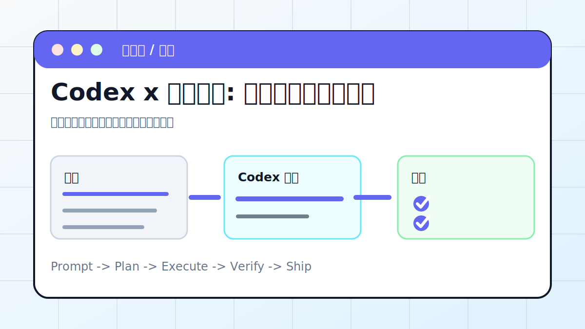

# Codex x 资料调研: 网络信息整理成报告



## 案例目标

让 Codex 先搜集和分级来源，再写有证据的报告。

**最终产出**：带来源的调研报告、证据表、待验证清单。

## 适合谁

要快速了解行业、产品、竞品或政策的人。

## 准备输入

- 调研问题
- 时间范围
- 可信来源优先级
- 报告格式

## 推荐提示词

```text
请调研这个主题并生成报告。要求：优先官方和一手来源；列出来源表；区分事实、推断和不确定信息；最后给出待验证问题。
```

## 执行流程

1. 拆解调研问题和关键词。
2. 按官方、一手、媒体、社区给来源分级。
3. 提取事实和数据，不急着写结论。
4. 生成报告、证据表和不确定项。
5. 标注更新时间和可能过期的信息。

## Codex 应该交付什么

- 一份可复查的执行摘要。
- 关键文件或产物路径。
- 运行过的验证命令。
- 未完成事项和风险说明。

## 验收标准

- 来源可点击。
- 事实和推断分开。
- 时间敏感信息有日期。
- 没有用单一来源下结论。

## 常见风险

- 引用过时资料。
- 把营销话术当事实。
- 没有说明不确定性。

## 复盘模板

```text
目标是否完成：
改动 / 产物：
验证命令：
验证结果：
保留或安全要求：
下一步：
```

## 下一步

要把报告变 PPT 看 ppt-skill.md。
