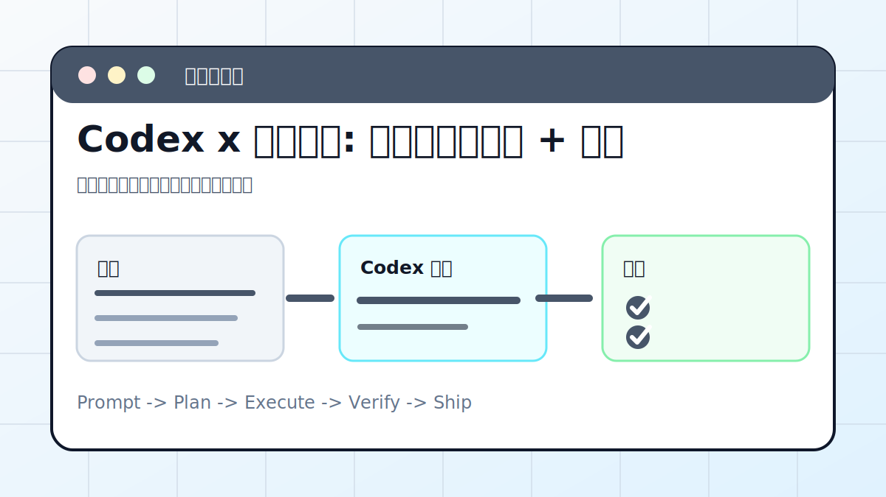

# Codex x 定时巡检: 服务器自动巡检 + 通知



## 案例目标

让 Codex 把服务器检查变成稳定脚本，并输出可读日报。

**最终产出**：巡检脚本、日报、告警规则、通知记录。

## 适合谁

需要每天检查服务器健康状态的人。

## 准备输入

- 服务器清单
- 检查项
- 阈值
- 通知渠道

## 推荐提示词

```text
请设计服务器巡检自动化。要求：检查磁盘、内存、CPU、服务状态和关键日志；失败写 errors.jsonl；每天输出 Markdown 报告；通知前先给我确认模板。
```

## 执行流程

1. 列出巡检指标和阈值。
2. 写只读检查脚本。
3. 生成 Markdown 报告模板。
4. 加入错误日志和退出码。
5. 设计通知渠道和人工确认点。

## Codex 应该交付什么

- 一份可复查的执行摘要。
- 关键文件或产物路径。
- 运行过的验证命令。
- 未完成事项和风险说明。

## 验收标准

- 脚本可重复运行。
- 报告包含异常和建议。
- 失败写日志。
- 不会自动删除或重启生产服务。

## 常见风险

- 自动修复过度。
- 阈值不合理导致噪音。
- 通知里泄露服务器信息。

## 复盘模板

```text
目标是否完成：
改动 / 产物：
验证命令：
验证结果：
保留或安全要求：
下一步：
```

## 下一步

网页定时抓取看 web-scrape.md。
