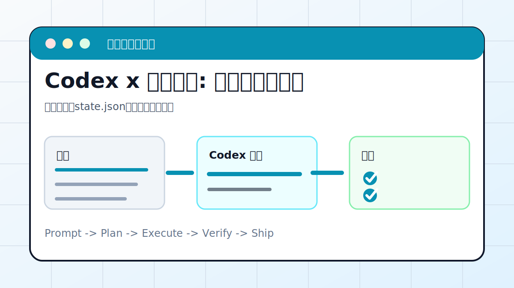

# Codex x 网页采集: 定时抓取并入库



## 案例目标

让 Codex 先跑通一次公开数据采集，再设计去重和日志。

**最终产出**：采集脚本、state.json、日志和数据文件。

## 适合谁

要长期跟踪公开网页更新的人。

## 准备输入

- 目标 URL
- 字段定义
- 抓取频率
- 存储方式

## 推荐提示词

```text
请为这个公开网页写一个采集脚本。要求：只抓公开内容；保存 state.json 去重；失败写 logs/errors.jsonl；输出扫描数量、新增数量、成功数量、失败数量。
```

## 执行流程

1. 确认 robots、登录要求和数据公开性。
2. 写最小脚本抓取一页。
3. 设计字段、去重 key 和 state.json。
4. 加日志、错误处理和限速。
5. 跑一次并输出统计。

## Codex 应该交付什么

- 一份可复查的执行摘要。
- 关键文件或产物路径。
- 运行过的验证命令。
- 未完成事项和风险说明。

## 验收标准

- 重复运行不会重复入库。
- 错误写入日志。
- 字段完整且类型稳定。
- 没有采集隐私或登录后数据。

## 常见风险

- 抓取频率过高。
- 页面结构变化导致静默失败。
- 没有去重。

## 复盘模板

```text
目标是否完成：
改动 / 产物：
验证命令：
验证结果：
保留或安全要求：
下一步：
```

## 下一步

要定时巡检服务器看 server-patrol.md。
