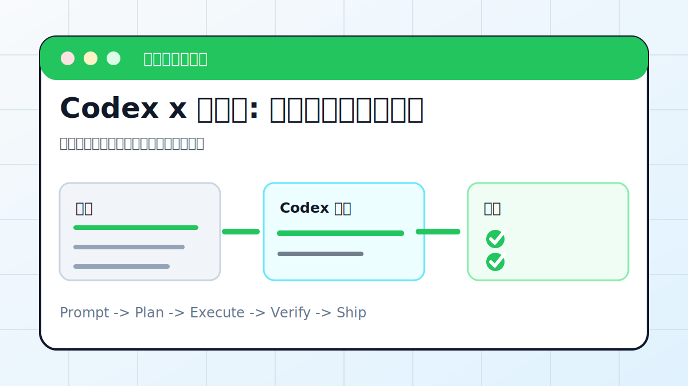

# Codex x 公众号: 内容采集与发布流程



## 案例目标

让 Codex 先整理文章草稿、配图和检查清单，发布前保留人工确认。

**最终产出**：公众号草稿包、封面建议、发布检查清单。

## 适合谁

要把资料整理成公众号文章并进入发布流程的人。

## 准备输入

- 素材链接或本地文档
- 账号发布规范
- 配图要求
- 是否只生成草稿

## 推荐提示词

```text
请把这些资料整理成公众号草稿。要求：输出 Markdown、封面图提示词、摘要、标题备选和自查清单；不要直接发布，发布前等我确认。
```

## 执行流程

1. 提取素材正文、图片和来源。
2. 确定文章结构和目标读者。
3. 生成 Markdown 草稿和标题备选。
4. 补封面图提示词和配图建议。
5. 按平台合规和错别字清单自查。

## Codex 应该交付什么

- 一份可复查的执行摘要。
- 关键文件或产物路径。
- 运行过的验证命令。
- 未完成事项和风险说明。

## 验收标准

- Markdown 可直接排版。
- 图片来源和用途清楚。
- 没有未授权转载内容。
- 发布动作等待确认。

## 常见风险

- 直接发布未审稿。
- 图片版权不清。
- 含敏感或违规表述。

## 复盘模板

```text
目标是否完成：
改动 / 产物：
验证命令：
验证结果：
保留或安全要求：
下一步：
```

## 下一步

要做视频版可看 animation-video.md。
